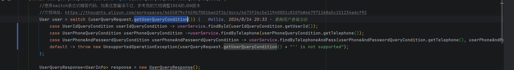
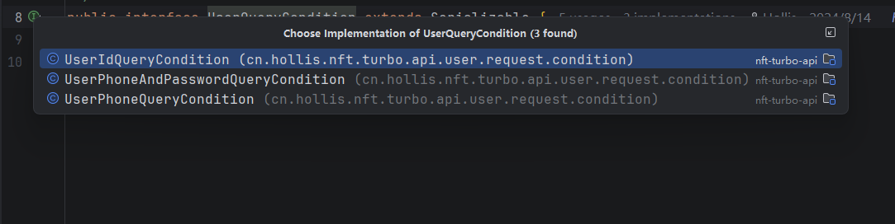
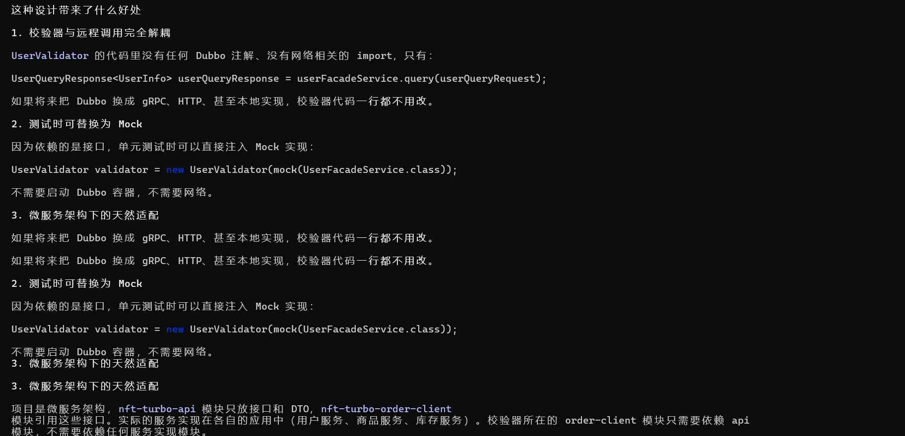
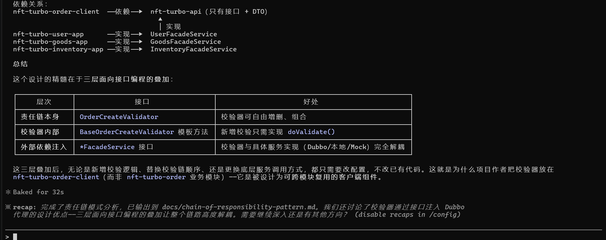

# 五一

1. 用户登录相关操作

其中涉及到多版本的 switch case 的使用方式；不同差别；

对于 JDK21 的类型推断来说， case 后面跟的参数类型一定是： switch 中的参数类型（子类等）



这里的 switch 中的： 参数类型 request.getUserQueryCondition() 其实是：Request 中持有的一个类型引用；

这个里面的 UserQueryCondition



## 布隆过滤器：

一定能判断某个数据不存在；bloomfilter 返回 false 代表 一定不存在

else 返回 true 某个数据可能存在或者这个数据是被误判了；这种情况下必须要查询一波数据库了；

dubbo 的超时时间；一旦消费者超时默认超时时间的话就会停止执行以下步骤；.

Consumer 发起调用

↓

等待 Provider 返回

↓

等了 3000ms（你配置的 timeout）

↓

还没返回

↓

Consumer 直接抛异常 ❌

等待返回结果【生产者的结果】； Dubbo 不能无限等待一个“疑似失败”的远程接口。

## page 分页

limit offset

page -1 \* pageSize

limit page-1 \* pageSize offset pageSize

```java
offset = (pageNum - 1) * pageSize;
pageSize  = pageSize;

select * from table limit #{offset}, #{pageSize};
// 取数据区间：[offset, offset + pageSize)


SELECT *  fROM table limit #{pageSize} offset #{offset}
```

pageHelper 和 Mp Page 的原理；

拦截 sql 生成 count 最后拼上 Limit；

原生 sql

SELECT \* FROM `order` WHERE user\_id > 1213;

第一步： Count SQL

SELECT  count（\*）FROM ‘t\_order’ where user\_id > 1213;

第二步：分页 SQL

SELECT \* from t\_order where user\_id > 1213 limit 0,10

向下取整： 等同于：

```plain
System.out.println(Math.floor(10.9));
System.out.println(Math.floor(10.1));
```

所以分页的总页数计算方式：

pageSize + total - 1 ) / pageSize

## 责任链

context

handler

pipeline

这种是管道编排 责任链条

底层设计

> 这是一种设计优点么，比如某一个校验器注入的是具备校验能力的引用类，真正实现是dubbo代理类，类似这样注入的是面向接口编程\
> ？

● 是的，这正是这个设计的一个重要优点。让我确认一下具体引用关系。

● 这确实是一个非常值得学习的设计优点，而且它在项目中体现得非常彻底。让我把完整的依赖注入链路梳理清楚：

校验器注入的全部是接口，而非实现类

UserValidator       ──注入──▶  UserFacadeService        (interface)\
GoodsValidator      ──注入──▶  GoodsFacadeService       (interface)\
StockValidator      ──注入──▶  InventoryFacadeService   (interface)\
GoodsBookValidator  ──注入──▶  GoodsFacadeService       (interface)

这四个 \*FacadeService 全部是纯接口，定义在 nft-turbo-api 模块中。

真正的实现在哪里

实际运行时，Spring 容器中的 Bean 是 Dubbo 生成的代理对象：

// BusinessDubboConfiguration.java — 调用方应用的配置\
@DubboReference(version = "1.0.0")\
private UserFacadeService userFacadeService;      // 这是 Dubbo 代理，不是本地实现

@DubboReference(version = "1.0.0")\
private GoodsFacadeService goodsFacadeService;    // 这也是 Dubbo 代理

@Bean\
@ConditionalOnMissingBean(name = "userFacadeService")\
public UserFacadeService userFacadeService() {    // 暴露为 Spring Bean\
return userFacadeService;\
}

@DubboReference 生成的代理类实现了 UserFacadeService 接口，底层通过网络 RPC\
调用远端服务。但校验器完全不知道这件事，它只看到 UserFacadeService 这个接口。





## Bean 有状态的时候该如何处理呢？

有状态的 Bean + 单例 + 多场景复用 = 一定出问题

👉 保留责任链 + next，但：

```plain
每次组链拿一套新对象
```

***

## ✔️ 本质：

```plain
隔离状态
```

***

## ✔️ 关键点：

```plain
ObjectProvider.getObject()
```

***

## ✔️ 优点：

* ✅ 保留责任链模式
* ✅ 不污染链

***

## ❗缺点：

* ❌ 稍微复杂
* ❌ Spring 使用门槛高
* ❌ 容易写错（比如误用 singleton）

***

👉 适合：你明确要用责任链模式时

也可以听 GPT 说的这样：

```java
@Configuration
public class ValidatorConfig {

    @Bean("createOrderValidators")
    public List<OrderValidator> createOrderValidators(
        UserValidator userValidator,
        GoodsValidator goodsValidator,
        StockValidator stockValidator) {

        return List.of(
            userValidator,
            goodsValidator,
            stockValidator
        );
    }

    @Bean("confirmOrderValidators")
    public List<OrderValidator> confirmOrderValidators(
        UserValidator userValidator,
        GoodsValidator goodsValidator) {

        return List.of(
            userValidator,
            goodsValidator
        );
    }
}

声明都一样；
最后执行的时候放在List中统一执行： 


@Component
public class ValidatorExecutor {

    public void execute(List<OrderValidator> validators,OrderCreateRequest request) {

        for (OrderValidator validator : validators) {
            validator.validate(request);
        }
    }
}
```


> 更新: 2026-05-03 09:40:04  
> 原文: <https://www.yuque.com/alice-hv75k/elcadl/bhna7rdx26c4a1v4>