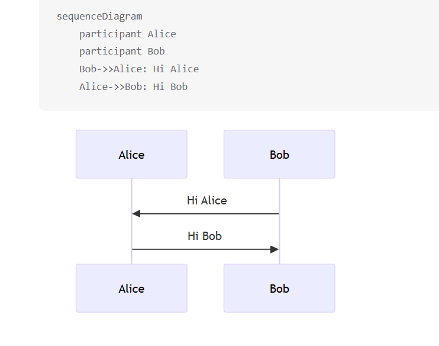

# Ability

一般业务思考的方向:

1. 参数校验与边界检查: 确保输入参数合法,防止非法数据进入核心逻辑
2. 状态一致性验证: 检查当前对象是否允许执行目标操作
3. 业务规则前置判断: 在执行操作前验证业务规则
4. 核心业务逻辑执行: 执行主要业务(如更新信息,状态变更
5. 缓存失效/更新: 处理相关缓存,确保数据一致性
6. 操作流水记录: 记录用户操作日志或者流水,便于审计 追踪
7. 异常处理和回滚: 合理处理异常情况,必要时进行事务回滚
8. 结果封装和返回 : 将操作结果封装成统一格式响应返回
9. 幂等性保证 : 对于重复操作能正常处理,避免重复执行副作用
10. 并发安全控制: 在必要处添加分布式锁等机制防止并发问题;

11.4 搭建一下文件系统的项目pom

技术: Springboot  Gateway  Nacos  Rocketmq  Seata XXL-job Dubbo Redis MySQL 

11.5 什么是幂等?

对于同一个操作,无论执行多少次,最终的结果都是一样的;

一锁

二判

三更新

11.6

sql语句的基本使用

from on join where group by having select DISTINCT order by limit 

使用: SequenceDiagram

语法:

复杂对象转成String -> 重写toString 方法

基本对象转成String ->  使用String.valueOf()方法;

> 更新: 2025-11-11 13:55:19  
> 原文: <https://www.yuque.com/alice-hv75k/mtczog/bbf0m6xrczdncvzq>