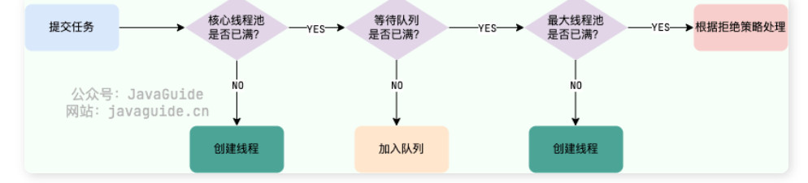

# JUC

2024年8月2日

08时02分

# 线程状态的区别

sleep() 进入到Blocked状态 , 需要满足一个条件后,才会恢复执行

waiting 进入waiting 状态, 同样不占用CPU,

两者的区别是: 一个是等待锁,一个是主动等人通知;

阻塞: 线程挂起,等待某个条件满足后再继续执行;

# JMM内存模型

cpu缓存模型 和 指令重排序

### cpu缓存模型:

* 目的: CPU缓存时为了缓解CPU和内存之间速度不匹配的问题
* 层次: 现代CPU缓存通常分为L1, L2, L3 等多层缓存.
* 问题: 多线程环境下,不同线程对同一变量进行操作可能导致缓存不一致
* 解决方案: 通过缓存一致性协议确保缓存数据一致性;

### 指令重排序:

* 定义: 为了提高执行效率,编译器和处理器可能会调整指令执行顺序
* 类型:

编译器优化重排: 编译器在不改变单线程程序语义的前提下重新安排指令.

指令并行重排: 处理器通过指令级并行技术将多条指令重叠执行

* 问题: 指令重排序可能导致多线程环境下的可见性和有序性的问题
* 解决方案: 通过内存屏障等机制限制重排序

### <font style="color:rgb(44, 44, 54);">Java内存模型</font>

* **<font style="color:rgb(44, 44, 54);">目的</font>**<font style="color:rgb(44, 44, 54);">：JMM旨在简化多线程编程，增强程序的可移植性。</font>
* **<font style="color:rgb(44, 44, 54);">定义</font>**<font style="color:rgb(44, 44, 54);">：JMM定义了线程和主内存之间的抽象关系，规定了从源代码到可执行指令的转换过程中需要遵循的并发原则。</font>
* **<font style="color:rgb(44, 44, 54);">主内存与本地内存</font>**<font style="color:rgb(44, 44, 54);">：</font>
  * **<font style="color:rgb(44, 44, 54);">主内存</font>**<font style="color:rgb(44, 44, 54);">：所有线程共享的内存区域，包含对象实例和其他共享数据。</font>
  * **<font style="color:rgb(44, 44, 54);">本地内存</font>**<font style="color:rgb(44, 44, 54);">：每个线程私有的工作内存，存储了共享变量的副本。</font>
* **<font style="color:rgb(44, 44, 54);">同步操作</font>**<font style="color:rgb(44, 44, 54);">：JMM定义了一系列同步操作，如lock、unlock、read、load、use、assign、store、write等，用于控制数据从主内存到本地内存的移动。</font>
* **<font style="color:rgb(44, 44, 54);">同步规则</font>**<font style="color:rgb(44, 44, 54);">：这些操作需要遵守一定的规则，以确保数据的一致性和可见性。</font>
* **<font style="color:rgb(44, 44, 54);">happens-before原则</font>**<font style="color:rgb(44, 44, 54);">：这是JMM中用来描述操作之间内存可见性的概念，确保前一个操作的结果对后一个操作可见。</font>
* **<font style="color:rgb(44, 44, 54);">并发关键字</font>**<font style="color:rgb(44, 44, 54);">：Java提供了诸如</font><code><font style="color:rgb(44, 44, 54);">volatile</font></code><font style="color:rgb(44, 44, 54);">、</font><code><font style="color:rgb(44, 44, 54);">synchronized</font></code><font style="color:rgb(44, 44, 54);">和各种</font><code><font style="color:rgb(44, 44, 54);">Lock</font></code><font style="color:rgb(44, 44, 54);">等关键字和类，帮助开发者编写线程安全的代码。</font>

### <font style="color:rgb(44, 44, 54);">总结:</font>

<font style="color:rgb(44, 44, 54);">我们定义的所有共享变量都存储在物理主内存中,</font>

<font style="color:rgb(44, 44, 54);">每一个线程都有自己独立的工作内存,里面保存该线程使用的变量副本(也就是从共享内存变量的拷贝)</font>

<font style="color:rgb(44, 44, 54);">线程对共享变量所有的操作都必须现在线程自己的工作内存进行后写回主内存,不能直接从主内存中读写</font>

<font style="color:rgb(44, 44, 54);">不同线程之间也无法访问其他线程的工作内存的变量,线程键的变量值的传递需要通过主内存来进行</font>

<font style="color:rgb(44, 44, 54);"></font>

## <font style="color:rgb(44, 44, 54);">并发编程的三个特点:</font>

1. **原子性**:<font style="color:rgb(44, 62, 80);">一次操作或者多次操作，要么所有的操作全部都得到执行并且不会受到任何因素的干扰而中断，要么都不执行。</font>
2. **可见性**:<font style="color:rgb(44, 62, 80);">当一个线程对共享变量进行了修改，那么另外的线程都是立即可以看到修改后的最新值。</font>
3. **有序性**:<font style="color:rgb(44, 62, 80);">由于指令重排序问题，代码的执行顺序未必就是编写代码时候的顺序。</font>

<font style="color:rgb(44, 62, 80);"></font>

<font style="color:rgb(44, 62, 80);"></font>

<font style="color:rgb(44, 62, 80);"></font>

# <font style="color:rgb(44, 62, 80);">线程池</font>

```java
        ThreadPoolExecutor poolExecutor = new ThreadPoolExecutor(
                1,
                1,
                15,
                TimeUnit.MINUTES,
                new ArrayBlockingQueue<>(2),
                Executors.defaultThreadFactory(),
                new  ThreadPoolExecutor.AbortPolicy()
        );

```

> 核心线程数加上阻塞队列的容量并不能直接表示线程池最多能成功执行的任务数量。线程池的执行能力和其配置参数有关，主要包括以下几个方面：
>
> \*\*核心线程数 (corePoolSize)：\*\*线程池中始终维持的线程数量。
>
> \*\*最大线程数 (maximumPoolSize)：\*\*线程池允许的最大线程数量。
>
> \*\*阻塞队列 (workQueue)：\*\*用于存放等待执行的任务队列。这个队列可以是有界的或无界的。
>
> \*\*空闲线程存活时间 (keepAliveTime)：\*\*非核心线程在空闲状态下的存活时间。
>
> **拒绝策略 (rejectedExecutionHandler)**：当线程池无法接受更多任务时所采取的策略。
>
> 当一个任务被提交到线程池时，线程池的工作流程大致如下：
>
> 如果当前正在运行的线程少于corePoolSize，即使线程池中的其他线程处于空闲状态，也会创建一个新的线程来处理新的任务。
>
> 如果正在运行的线程等于corePoolSize，那么新任务将被放入阻塞队列中等待执行。
>
> 如果队列满了，并且当前正在运行的线程少于maximumPoolSize，则会创建新的线程来处理新任务。
>
> 如果队列满了，并且当前正在运行的线程等于maximumPoolSize，那么线程池会根据拒绝策略来处理新任务。
>
> 因此，线程池最多能成功执行的任务数量取决于多个因素：
>
> 如果阻塞队列是有界的，那么线程池最多能处理的任务数量为 corePoolSize + 阻塞队列的容量 + (maximumPoolSize - corePoolSize)。这是因为当阻塞队列满时，线程池还可以创建额外的线程直到达到maximumPoolSize。
>
> 如果阻塞队列是无界的（例如SynchronousQueue），那么线程池理论上可以处理无限数量的任务，只要不超过maximumPoolSize。
>
> 在您的例子中，如果线程池配置如下：
>
> 核心线程数为1
>
> 最大线程数为1
>
> 阻塞队列容量为2
>
> 那么线程池最多可以处理的任务数量为 1 + 2 = 3。这是因为核心线程数为1，意味着始终有一个线程可用；如果有两个任务在队列中等待，那么当这三个任务都被处理后，任何额外的任务都会被拒绝，除非您使用了特定的拒绝策略来处理这种情况。

## 线程池的工作工作过程:

1. 线程过来的时候 首先判断线程数是否小于核心线程数,如果小于,则会创建核心线程
2. 当线程数大于或者登录核心线程数,就会进入任务队列
3. 当任务队列满了,且线程数小于最大线程数,则会创建线程,也就是非核心线程,来处理任务
4. 当有线程再次进入发现大于线程池中最大线程数,则会执行拒绝策略,具体的拒绝策略有所不同.



> * <font style="color:rgb(44, 44, 54);">如果当前活跃线程少于核心线程数（</font><code><font style="color:rgb(44, 44, 54);">corePoolSize</font></code><font style="color:rgb(44, 44, 54);">），即使线程池中存在空闲线程，也会创建新的核心线程来处理新任务。</font>
> * <font style="color:rgb(44, 44, 54);">如果当前活跃线程等于核心线程数，新任务会被放入任务队列（如 </font><code><font style="color:rgb(44, 44, 54);">LinkedBlockingQueue</font></code><font style="color:rgb(44, 44, 54);">, </font><code><font style="color:rgb(44, 44, 54);">ArrayBlockingQueue</font></code><font style="color:rgb(44, 44, 54);"> 等）等待执行。</font>
> * <font style="color:rgb(44, 44, 54);">如果任务队列已满并且当前活跃线程数少于最大线程数（</font><code><font style="color:rgb(44, 44, 54);">maximumPoolSize</font></code><font style="color:rgb(44, 44, 54);">），线程池会创建非核心线程来处理任务。这些非核心线程在空闲一段时间后可能会被销毁。</font>
> * <font style="color:rgb(44, 44, 54);">如果所有条件都不满足，即任务队列已满且当前活跃线程已经达到最大线程数，线程池会采取拒绝策略来处理新任务。常见的拒绝策略包括但不限于：</font>
>   * <code><font style="color:rgb(44, 44, 54);">AbortPolicy</font></code><font style="color:rgb(44, 44, 54);">：抛出</font><font style="color:rgb(44, 44, 54);"> </font><code><font style="color:rgb(44, 44, 54);">RejectedExecutionException</font></code><font style="color:rgb(44, 44, 54);"> </font><font style="color:rgb(44, 44, 54);">异常。</font>
>   * <code><font style="color:rgb(44, 44, 54);">CallerRunsPolicy</font></code><font style="color:rgb(44, 44, 54);">：调用者所在的线程会执行该任务。</font>
>   * <code><font style="color:rgb(44, 44, 54);">DiscardPolicy</font></code><font style="color:rgb(44, 44, 54);">：不处理该任务，直接丢弃。</font>
>   * <code><font style="color:rgb(44, 44, 54);">DiscardOldestPolicy</font></code><font style="color:rgb(44, 44, 54);">：丢弃队列中最旧的任务并尝试重新添加新任务。</font>在 Java 中使用 CompletableFuture 实现异步多线程任务时，异常处理是非常关键的一环。由于异步任务是并发执行的，如果某个线程抛出异常而没有正确捕获和处理，异常可能会被“吞掉”或导致整个程序行为异常。

***

## 🧱<font style="color:rgb(44, 44, 54);"> 一、CompletableFuture 异常处理机制</font>

<font style="color:rgb(44, 44, 54);">在 CompletableFuture 中，任何一个阶段抛出异常都会导致整个 Future 变为异常状态，后续的 .thenApply、.thenAccept 等操作不会执行，除非你显式地使用异常处理方法（如 .exceptionally() 或 .handle()）。</font>

***

## 🧪<font style="color:rgb(44, 44, 54);"> 二、处理异常的几种方式</font>

### ✅<font style="color:rgb(44, 44, 54);"> 1. 使用 .exceptionally() 处理异常（类似 catch）</font>

```java
CompletableFuture<Integer> future = CompletableFuture.supplyAsync(() -> {
    if (true) throw new RuntimeException("出错了！");
    return 100;
}).exceptionally(ex -> {
    System.out.println("发生异常: " + ex.getMessage());
    return 0; // 默认值
});

System.out.println(future.join()); // 输出: 0
```

> <font style="color:rgb(44, 44, 54);">适用场景：你希望在某个阶段出现异常时提供一个默认值或兜底逻辑。</font>

***

### ✅<font style="color:rgb(44, 44, 54);"> 2. 使用 .handle() 处理结果或异常（类似 try-catch-finally）</font>

```java
CompletableFuture<Integer> future = CompletableFuture.supplyAsync(() -> {
    if (true) throw new RuntimeException("出错了！");
    return 100;
}).handle((result, ex) -> {
    if (ex != null) {
        System.out.println("捕获异常: " + ex.getMessage());
        return 0; // 出错时返回默认值
    }
    return result;
});

System.out.println(future.join()); // 输出: 0
```

> <font style="color:rgb(44, 44, 54);">适用场景：你既想处理正常结果，又想处理异常，统一处理逻辑。</font>

***

### ✅<font style="color:rgb(44, 44, 54);"> 3. 使用 .whenComplete() 仅观察结果或异常（不改变结果）</font>

```java
CompletableFuture<Integer> future = CompletableFuture.supplyAsync(() -> {
    if (true) throw new RuntimeException("出错了！");
    return 100;
}).whenComplete((result, ex) -> {
    if (ex != null) {
        System.out.println("观察到异常: " + ex.getMessage());
    } else {
        System.out.println("结果是: " + result);
    }
});

// 注意：异常仍然存在，未被处理，后续操作仍会失败
try {
    System.out.println(future.get()); // 会抛出异常
} catch (Exception e) {
    e.printStackTrace();
}
```

> <font style="color:rgb(44, 44, 54);">适用场景：你只是想观察结果或异常，不改变最终结果，适合用于日志记录、监控等。</font>

***

### ✅<font style="color:rgb(44, 44, 54);"> 4. 使用 .handleAsync() 或 .exceptionallyAsync() 异步处理异常</font>

<font style="color:rgb(44, 44, 54);">如果你希望异常处理也在另一个线程中执行，可以使用异步版本：</font>

```java
CompletableFuture<Integer> future = CompletableFuture.supplyAsync(() -> {
    if (true) throw new RuntimeException("出错了！");
    return 100;
}).handleAsync((result, ex) -> {
    if (ex != null) {
        System.out.println("异步处理异常: " + ex.getMessage());
        return 0;
    }
    return result;
});
```

> <font style="color:rgb(44, 44, 54);">适用场景：希望在异步线程中进行异常处理，避免阻塞主线程。</font>

***

## ⚠️<font style="color:rgb(44, 44, 54);"> 三、注意事项</font>

### <font style="color:rgb(44, 44, 54);">1. 异常会中断链式调用</font>

<font style="color:rgb(44, 44, 54);">如果某个阶段抛出异常且没有处理，后续 .thenApply() 等操作将不会执行。</font>

```java
CompletableFuture<Integer> future = CompletableFuture.supplyAsync(() -> {
    throw new RuntimeException("出错了");
}).thenApply(x -> x * 2);

future.join(); // 会抛出异常
```

### <font style="color:rgb(44, 44, 54);">2. 异常不会立即抛出</font>

<font style="color:rgb(44, 44, 54);">使用 .join() 或 .get() 时才会真正抛出异常。</font>

```java
try {
    Integer result = future.get();
} catch (ExecutionException e) {
    e.getCause(); // 获取原始异常
}
```

### <font style="color:rgb(44, 44, 54);">3. 推荐使用 .handle() 而不是 .exceptionally()</font>

<font style="color:rgb(44, 44, 54);">.handle() 更强大，可以同时处理正常结果和异常，适合统一处理逻辑。</font>

***

## 🧩<font style="color:rgb(44, 44, 54);"> 四、实际使用建议</font>

| <font style="color:rgb(44, 44, 54);">方法</font> | <font style="color:rgb(44, 44, 54);">是否能改变结果</font> | <font style="color:rgb(44, 44, 54);">是否异步</font> | <font style="color:rgb(44, 44, 54);">适用场景</font> |
| --- | --- | --- | --- |
| <font style="color:rgb(44, 44, 54);">.exceptionally()</font> | ✅ | ❌ | <font style="color:rgb(44, 44, 54);">提供默认值</font> |
| <font style="color:rgb(44, 44, 54);">.handle()</font> | ✅ | ❌ | <font style="color:rgb(44, 44, 54);">统一处理结果和异常</font> |
| <font style="color:rgb(44, 44, 54);">.handleAsync()</font> | ✅ | ✅ | <font style="color:rgb(44, 44, 54);">异步处理异常</font> |
| <font style="color:rgb(44, 44, 54);">.whenComplete()</font> | ❌ | ❌ | <font style="color:rgb(44, 44, 54);">观察结果/异常，不改变结果</font> |

***

## ✅<font style="color:rgb(44, 44, 54);"> 五、综合示例（推荐写法）</font>

```java
CompletableFuture<Integer> future = CompletableFuture.supplyAsync(() -> {
    // 模拟异常
    if (Math.random() > 0.5) throw new RuntimeException("随机错误");
    return 100;
}).handle((result, ex) -> {
    if (ex != null) {
        System.out.println("统一处理异常: " + ex.getMessage());
        return -1; // 返回错误码或默认值
    }
    return result;
});

System.out.println("最终结果: " + future.join());
```

***

## 🚀<font style="color:rgb(44, 44, 54);"> 六、进阶：组合多个 Future 时的异常处理</font>

```java
CompletableFuture<Integer> f1 = CompletableFuture.supplyAsync(() -> 10 / 0);
CompletableFuture<Integer> f2 = CompletableFuture.supplyAsync(() -> 20);

CompletableFuture<Void> allFutures = CompletableFuture.allOf(f1, f2);

allFutures.exceptionally(ex -> {
    System.out.println("组合任务异常: " + ex.getMessage());
    return null;
});
```

***

## ✅<font style="color:rgb(44, 44, 54);"> 总结</font>

| <font style="color:rgb(44, 44, 54);">场景</font> | <font style="color:rgb(44, 44, 54);">推荐方法</font> |
| --- | --- |
| <font style="color:rgb(44, 44, 54);">单个 Future 异常处理</font> | <font style="color:rgb(44, 44, 54);">.handle()</font> |
| <font style="color:rgb(44, 44, 54);">提供默认值</font> | <font style="color:rgb(44, 44, 54);">.exceptionally()</font> |
| <font style="color:rgb(44, 44, 54);">异步处理异常</font> | <font style="color:rgb(44, 44, 54);">.handleAsync()</font> |
| <font style="color:rgb(44, 44, 54);">观察异常</font> | <font style="color:rgb(44, 44, 54);">.whenComplete()</font> |
| <font style="color:rgb(44, 44, 54);">多个 Future 组合处理</font> | <font style="color:rgb(44, 44, 54);">.allOf().exceptionally()</font> |

***

<font style="color:rgb(44, 44, 54);">如果你有具体的业务场景（如并发调用多个接口、链式调用、超时处理等），我可以提供更针对性的异常处理代码模板。欢迎继续提问！</font>🚀

#

## 两种执行任务的方法区别?

使用`Executor`.execute方法<font style="color:rgb(34, 34, 34);">仅支持</font><code><font style="color:rgb(34, 34, 34);">Runnable</font></code><font style="color:rgb(34, 34, 34);">任务（无返回值）</font>

<font style="color:rgb(34, 34, 34);">使用</font><code><font style="color:rgb(34, 34, 34);">ExecutorService</font></code><font style="color:rgb(34, 34, 34);">.submit方法: 支持</font><code><font style="color:rgb(34, 34, 34);">Runnable</font></code><font style="color:rgb(34, 34, 34);">、</font><code><font style="color:rgb(34, 34, 34);">Callable<T></font></code><font style="color:rgb(34, 34, 34);">（可有返回值） 可以通过</font>

<font style="color:rgb(34, 34, 34);">future.get()获取异步任务返回结果</font>

**<font style="color:#E4495B;">异常处理情况</font>**

* <code>**<font style="color:rgb(34, 34, 34);">execute()</font>**</code><font style="color:rgb(34, 34, 34);">：</font>
  * <font style="color:rgb(34, 34, 34);">任务中的未捕获异常会抛出到当前线程的</font><code><font style="color:rgb(34, 34, 34);">UncaughtExceptionHandler</font></code><sup><font style="color:rgb(34, 34, 34);background-color:rgb(247, 248, 250);"></font></sup><font style="color:rgb(34, 34, 34);">。</font>
  * <font style="color:rgb(34, 34, 34);">若未设置处理器，异常可能被静默吞没</font><sup><font style="color:rgb(34, 34, 34);background-color:rgb(247, 248, 250);"></font></sup><font style="color:rgb(34, 34, 34);">。</font>
* <code>**<font style="color:rgb(34, 34, 34);">submit()</font>**</code><font style="color:rgb(34, 34, 34);">：</font>
  * <font style="color:rgb(34, 34, 34);">异常被封装在</font><code><font style="color:rgb(34, 34, 34);">Future</font></code><font style="color:rgb(34, 34, 34);">对象中，调用</font><code><font style="color:rgb(34, 34, 34);">Future.get()</font></code><font style="color:rgb(34, 34, 34);">时以</font><code><font style="color:rgb(34, 34, 34);">ExecutionException</font></code><font style="color:rgb(34, 34, 34);">形式抛</font><sup><font style="color:rgb(34, 34, 34);background-color:rgb(247, 248, 250);"></font></sup><font style="color:rgb(34, 34, 34);">。</font>
  * <font style="color:rgb(34, 34, 34);">若不调用</font><code><font style="color:rgb(34, 34, 34);">get()</font></code><font style="color:rgb(34, 34, 34);">，异常可能被忽略。</font>

# <font style="color:#DF2A3F;">异步线程中处理异常的方式:</font>

既然使用了execute()方法会抛出当前线程的uncaughtExceptionHandler

在线程工厂中设置相关api

```java
        ThreadFactory threadFactory = new ThreadFactory() {
            private final AtomicInteger counter = new AtomicInteger(0);
            
            @Override
            public Thread newThread(Runnable r) {
                Thread thread = new Thread(r, "CustomThread-" + counter.incrementAndGet());
                // 为线程设置未捕获异常处理器
                thread.setUncaughtExceptionHandler((t, e) -> {
                    System.out.println("  线程 " + t.getName() + " 发生未捕获异常: " + e.getMessage());
                });
                return thread;
            }
        };
```

使用CompletableFuture来解决相关异常:

使用`exceptionally`或者使用`handle`

diff

```java
CompletableFuture.supplyAsync(() -> {
    if (error) throw new RuntimeException("失败");
    return "成功";
}).exceptionally(ex -> {
    System.out.println("捕获异常: " + ex.getMessage());
    return "默认值";  // 异常时返回替代值
}).thenAccept(System.out::println); // 输出"默认值"
```

* <font style="color:rgb(34, 34, 34);">数据库查询失败时返回缓存默认值</font>
* <font style="color:rgb(34, 34, 34);">外部服务调用超时时返回本地兜底数据</font>

<font style="color:rgb(34, 34, 34);"></font>

```java
future.handle((result, ex) -> {
    if (ex != null) {
        System.err.println("异常: " + ex.getMessage());
        return "降级结果";  // 异常时补偿
    }
    return result + "_处理后"; // 正常时转换结果
});
```

**<font style="color:rgb(34, 34, 34);">成功和失败时都执行逻辑</font>**

在线程工厂中设置全局未捕获异常

```java
Thread.setDefaultUncaughtExceptionHandler((thread,exception)  -> 
   System.out.println("  全局异常处理器捕获到线程 " + 
                      thread.getName() + " 的异常: " 
                      + exception.getMessage());
```

thenAccept :  接收结果但不返回新值

thenApply: 接收上一阶段的结果作为输入参数;对该输入进行处理后，返回一个新的结果供后续阶段使用


> 更新: 2025-12-08 15:57:23  
> 原文: <https://www.yuque.com/alice-hv75k/mtczog/cf334qgeqhvc0aog>