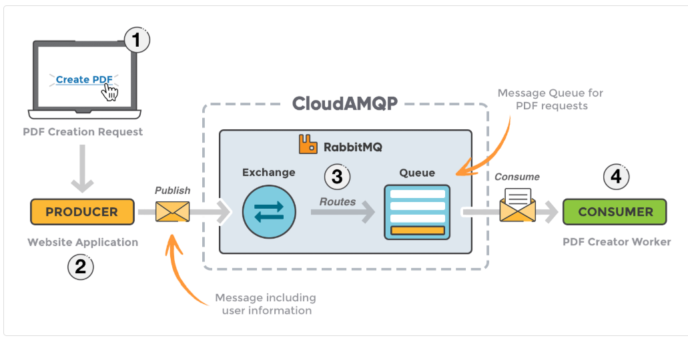
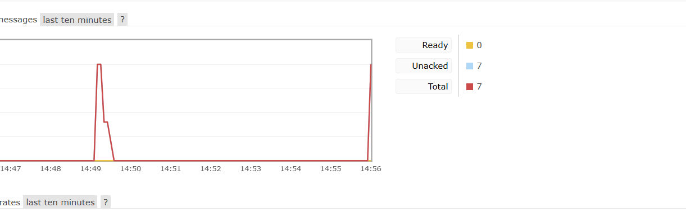
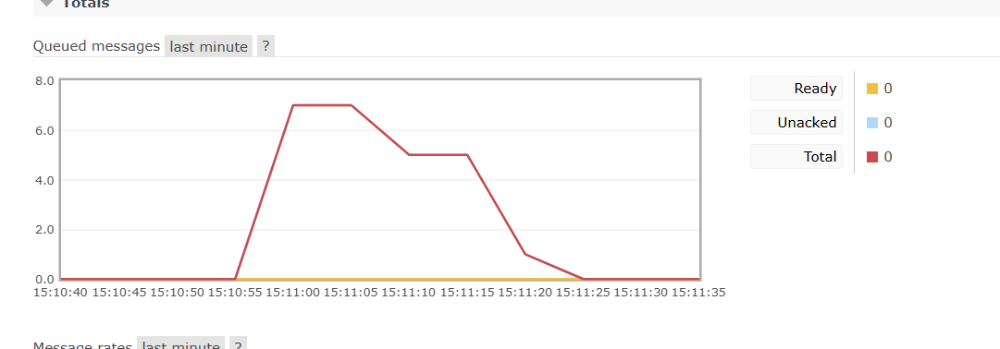
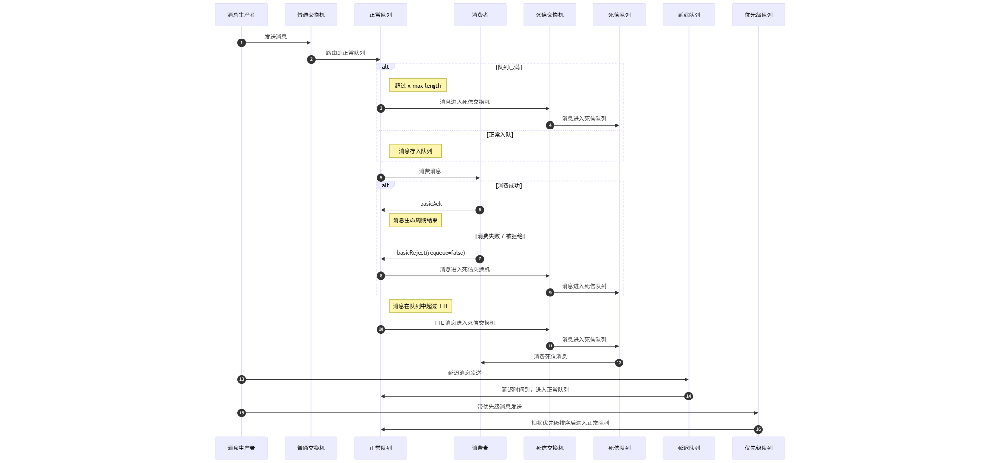

# Rabbitmq

[https://xie.infoq.cn/article/12c4bd997a7bd20985f2ddc00](https://xie.infoq.cn/article/12c4bd997a7bd20985f2ddc00)





**<font style="color:rgb(13, 13, 13);background-color:rgb(244, 246, 248);">Broker 是 RabbitMQ 的服务器进程。Exchange 和 Queue 是定义在 Broker 内部的、用于实现消息路由和存储的逻辑对象。Broker 通过管理这些对象来提供完整的消息队列服务</font>**

**<font style="color:rgb(13, 13, 13);background-color:rgb(244, 246, 248);"></font>**

**<font style="color:rgb(13, 13, 13);background-color:rgb(244, 246, 248);"></font>**

<font style="color:rgb(13, 13, 13);background-color:rgb(244, 246, 248);">可以看到在手动去ack消息的</font>


```java
@RabbitListener(queues = RabbitMQConfig.QUEUE_NAME)
public void receive(Message message, Channel channel){
    long deliveryTag = message.getMessageProperties().getDeliveryTag();
    String messageEntity = new String(message.getBody());
    log.info("消息id:{}",deliveryTag);
    log.info("消息实体: {} ",messageEntity);

    try {
        Thread.sleep(3000);
        log.info("消息消费成功");
        channel.basicAck(deliveryTag,false);
    } catch (Exception e) {
        log.error("消息消费失败：{}",e.getMessage());
        try {
            //不重新入队
            channel.basicNack(deliveryTag,false,false);
        } catch (Exception ex) {
            log.error("消息消费失败：{}",ex.getMessage());
        }
    }
```




出现异常直接丢不重新进入队列:

 channel.basicNack(deliveryTag,false,false);




拒绝或者ttl过期进入到死信队列

DLX

```java
@Bean
public Queue normalQueue() {
    Map<String, Object> args = new HashMap<>();
    // 指定死信交换机和路由键
    args.put("x-dead-letter-exchange", DEAD_EXCHANGE);
    args.put("x-dead-letter-routing-key", DEAD_ROUTING_KEY);
    // 设置消息过期时间 (5秒)
    args.put("x-message-ttl", 5000);
    return QueueBuilder.durable(NORMAL_QUEUE).withArguments(args).build();
}
```





> 更新: 2025-11-13 16:02:36  
> 原文: <https://www.yuque.com/alice-hv75k/mtczog/niws8vei0xmhacmt>