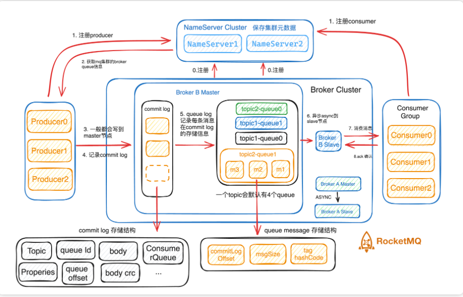
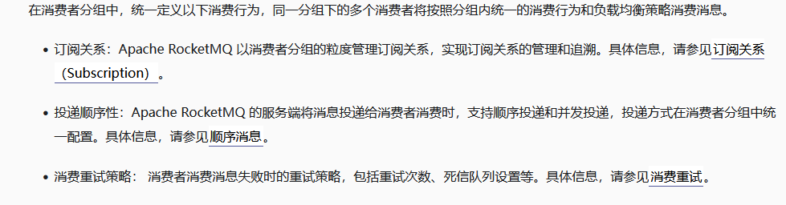

# RocketMq

# 基本原理



概念

| <font style="color:rgb(243, 243, 243);">名称</font> | <font style="color:rgb(243, 243, 243);">通俗解释</font> | <font style="color:rgb(243, 243, 243);">类比</font> |
| :--- | :--- | :--- |
| <font style="color:rgb(243, 243, 243);">消息</font> | <font style="color:rgb(243, 243, 243);">要传递的内容，比如订单信息</font> | <font style="color:rgb(243, 243, 243);">一封信 / 一条通知</font> |
| <font style="color:rgb(243, 243, 243);">生产者</font> | <font style="color:rgb(243, 243, 243);">发送消息的应用</font> | <font style="color:rgb(243, 243, 243);">寄信人 / 发件方</font> |
| <font style="color:rgb(243, 243, 243);">消费者</font> | <font style="color:rgb(243, 243, 243);">接收并处理消息的应用</font> | <font style="color:rgb(243, 243, 243);">收信人 / 处理方</font> |
| <font style="color:rgb(243, 243, 243);">Topic</font> | <font style="color:rgb(243, 243, 243);">消息的分类（大主题）</font> | <font style="color:rgb(243, 243, 243);">邮箱的分类文件夹</font> |
| <font style="color:rgb(243, 243, 243);">Tag</font> | <font style="color:rgb(243, 243, 243);">更细的消息分类（小标签）</font> | <font style="color:rgb(243, 243, 243);">文件夹下的标签</font> |
| <font style="color:rgb(243, 243, 243);">Broker</font> | <font style="color:rgb(243, 243, 243);">存储和转发消息的服务器</font> | <font style="color:rgb(243, 243, 243);">邮局的仓库</font> |
| <font style="color:rgb(243, 243, 243);">NameServer</font> | <font style="color:rgb(243, 243, 243);">路由导航，告诉谁在哪</font> | <font style="color:rgb(243, 243, 243);">邮局的查询 / 导航中心</font> |
| <font style="color:rgb(243, 243, 243);">消息队列</font> | <font style="color:rgb(243, 243, 243);">Topic 下实际存消息的小格子</font> | <font style="color:rgb(243, 243, 243);">信箱中的一个个小格子</font> |

使用:引入 mq 依赖:

```plain
<dependency>
    <groupId>org.apache.rocketmq</groupId>
    <artifactId>rocketmq-spring-boot-starter</artifactId>
    <version>2.3.0</version>
</dependency>
```

```plain
rocketmq:
  name-server: 127.0.0.1:9876
  producer:
    group: demo-producer-group

```

2.生产者 使用在容器中:使用

```plain
@Autowired
private RocketMQTemplate rocketMQTemplate;


template.convertAndSend(topic,message);
```

消费者标注:

```plain
@Service
@RabbitMQMessageListener(topic = "demo-topic", consumerGroup = "demo-consumer-group")


实现 RocketMQListener接口<>e​​​​​​
```

* **<font style="color:rgba(0, 0, 0, 0.86);">一个 Partition 在同一时间只能被组内的一个消费者消费</font>**<font style="color:rgba(0, 0, 0, 0.86);">，但可以被多个不同组的消费者消费。</font>

消息实体包含什么:

```java
public class Message {
    private String topic;           // 主题
    private String body;            // 消息内容（byte[]）
    private String tags;            // 标签，用于过滤（可选）
    private String keys;            // 消息唯一标识，用于查询
    private long bornTimestamp;     // 创建时间
    private String messageId;       // 全局唯一ID（由客户端生成）
    private int delayTimeLevel;     // 延迟级别（用于定时消息）
    private Map<String, String> properties; // 自定义属性
}
```

# 主题Topic

不同业务类型的数据拆分到不同的主题中管理，通过主题实现存储的隔离性和订阅隔离性。

topic内部是由队列组成的,真正存放消息的位置在队列中; (1个主题 至少包含1个队列)

消息类型:

* Normal :普通消息, 消息直接没有任何关联
* FIFO : 顺序消息
* Delay : 定时延迟消息
* Transaction : 事务消息,高级特性(half message  ->  commit  -> 流转到其他事务);

\*\* 注意点:\*\*

消息类型是否一致：不同类型的消息，如顺序消息和普通消息需要使用不同的主题  否则会报错: 消息类型不匹配;

生产者面向主题,向主题内部发送消息,实际消息发送在该主题的某一个队列下面;

# 队列Message Queue

存储消息具备顺序性:

队列头部是最早写入的消息; 队列尾部是最新写入的消息, 消息直接通过位点(offset)进行标记管理;

属性:

6(读写) 4 (只读) 2 (只写) 0

注意点:

少用,够用就行

# 消息Message

特点: 消息不可变性 和消息持久化

属性:

可以从sdk中取得 所属的topic , message queue, offset, message type

消息Id:消息的唯一标识

消息大小:

* 普通和顺序消息：4 MB
* 事务和定时或延时消息：64 KB

# 生产者Producer

用来构建并传输消息到服务端的运行实体

发送方式: 使用api 可以同步可以异步

批量发送: 消息批量api

# 消费者组ConsumerGroup

系统中承载消费行为一致的消费者的负载均衡分组;



# 消费者Consumer

# Broker就是RocketMQ的服务端

broker与namesrv建立(推)连接之后,producer 和 consumer 就会拉去broker中信息

这样producer就能和某一个topic中queue进行通信了;

非常典型，直接点出核心：**RocketMQ 的重试机制 + Spring Boot Starter 的反序列化时机 + Tag/队列的生效边界** 共同导致了“怎么改都停不下来”的现象。下面按 **“为什么无效 → 如何立即停止 → 如何彻底修复”** 给你可落地的方案。

***

### 🔍 为什么加 Tag、换队列都没用？

| 你的操作 | 实际底层行为 | 为什么无效 |
| :--- | :--- | :--- |
| **加 Tag** | Dashboard 发消息时若未指定 Tag，消息 Tag 为空或 `*`。重试消息**100% 继承原始消息的 Tag 和属性**。你后续改 Consumer 的 `selectorExpression` 只影响**新拉取**的消息，对已进入 `%RETRY%` 队列的消息无效。 | 重试队列不重新计算订阅过滤，按原始属性投递。 |
| **换队列** | `%RETRY%<GROUP>` 是 Broker 独立维护的逻辑队列，与原始 Topic 的物理队列完全解耦。重试消息走独立的 Delay Schedule 逻辑。 | 换原始 Topic 队列不影响重试队列的投递行为。 |
| **框架层异常** | `rocketmq-spring-boot-starter` 在调用你的 `@RocketMQMessageListener` **之前**，会先执行 `MessageConverter` 反序列化。格式不匹配直接抛 `MessageConversionException`，框架捕获后自动返回 `RECONSUME_LATER`，触发重试。 | 异常发生在业务方法外，你的 `try-catch` 根本拦截不到。 |

***

### 🚨 立即止血：如何干掉正在无限重试的那条消息？（3选1）

#### ✅ 方案 1：控制台清理（最快，推荐）

1. 登录 RocketMQ Dashboard
2. 进入 `Message` → `Query by Topic`
3. Topic 输入：`%RETRY%你的消费者组名` （例如 `%RETRY%consumer2`）
4. 查询到那条卡住的消息 → 点击 **Delete**（或 `Reset Offset` 将该 Group 的消费位点拉到最新）

> 💡 如果 Dashboard 不支持删除单条重试消息，可直接查询 `%DLQ%你的消费者组名`（死信队列），重试耗尽后消息会自动进去，直接清 DLQ 即可。

#### ✅ 方案 2：临时调小重试次数，快速打入 DLQ

在 `application.yml` 或注解中临时设置：

```yaml
rocketmq:
  consumer:
    max-reconsume-times: 1 # 默认16，改为1让消息快速失败
```

或注解：

```java
@RocketMQMessageListener(topic = "TOPIC", consumerGroup = "consumer2", maxReconsumeTimes = 1)
```

重启 Consumer 后，该消息最多重试 1 次就会进入 `%DLQ%`，然后去 Dashboard 清理 DLQ 即可。**处理完后务必改回原值**。

#### ✅ 方案 3：临时改接收类型为 `byte[]` 跳过反序列化

```java
@RocketMQMessageListener(topic = "TOPIC", consumerGroup = "consumer2")
public class FixConsumer implements RocketMQListener<byte[]> {
    @Override
    public void onMessage(byte[] message) {
        // 直接返回成功，不再触发重试
        // 可在此记录日志或人工处理
    }
}
```

部署后，下次拉取到该重试消息时，框架不再尝试反序列化，直接调用 `onMessage`，消息被消费成功。**注意：仅用于清理脏数据，清理后需恢复原逻辑。**

***

### 🛠 代码级根治（适配 spring-boot-starter）

#### 1. 强制统一接收格式（推荐 `byte[]` 或 `String`）

```java
@Component
@RocketMQMessageListener(
    topic = "YOUR_TOPIC", 
    consumerGroup = "consumer2",
    maxReconsumeTimes = 3, // 明确限制重试
    consumeMode = ConsumeMode.CONCURRENTLY
)
public class SafeConsumer implements RocketMQListener<String> {

    @Override
    public void onMessage(String message) {
        try {
            // 手动按需转换，失败不抛异常
            if (message.startsWith("{") || message.startsWith("[")) {
                Map<String, String> map = JSON.parseObject(message, Map.class);
                handleMap(map);
            } else {
                handleString(message);
            }
        } catch (Exception e) {
            log.error("消息解析失败，原始内容: {}", message, e);
            // ⚠️ 关键：不要抛异常！直接 return 即表示 CONSUME_SUCCESS
        }
    }
}
```

#### 2. 全局配置转换器容错（不改 Listener 签名）

```java
@Component
public class SafeMessageConverter implements MessageConverter {
    @Override
    public boolean supports(Class<?> clazz) { return true; }

    @Override
    public Object fromMessage(Message<?> message, Class<?> targetClass) {
        byte[] payload = (byte[]) message.getPayload();
        String body = new String(payload, StandardCharsets.UTF_8);
        try {
            return JSON.parseObject(body, targetClass);
        } catch (Exception e) {
            // 转换失败返回空对象，阻断异常向上传播
            return targetClass.getDeclaredConstructor().newInstance();
        }
    }

    @Override
    public Message<?> toMessage(Object payload, MessageHeaders headers) {
        throw new UnsupportedOperationException();
    }
}
```

***

### 📜 核心机制补充（避坑指南）

| 机制 | 说明 |
| :--- | :--- |
| **Pub/Sub 模型** | 同一个 Topic 下，**所有 ConsumerGroup 都会收到所有消息**，无论 Producer 是谁、发什么格式。这是设计如此，非 Bug。 |
| **重试队列本质** | `%RETRY%<GROUP>` 是普通 Topic，消息携带原始 `Topic/Tag/Keys/Body`。Broker 按延迟策略重新投递，**不重新计算订阅表达式**。 |
| **框架反序列化时机** | `rocketmq-spring-boot-starter` 调用链：`拉取 → MessageConverter → 调用 onMessage()`。转换器抛异常 = 消费失败 = 自动重试。 |
| **Tag 过滤边界** | Tag 过滤在 **Broker 投递时** 生效。已通过过滤的消息进入重试队列后，Tag 属性被固化，后续订阅变更不影响已入队消息。 |

***

### ✅ 操作 Checklist

1. **立即**：去 Dashboard 清理 `%RETRY%consumer2` 或 `%DLQ%consumer2` 中的卡死消息。
2. **配置**：设置 `maxReconsumeTimes = 3`（不要依赖默认 16）。
3. **代码**：将 Consumer 接收类型改为 `String` 或 `byte[]`，内部 `try-catch` 兼容解析，**绝不向框架抛异常**。
4. **规范**：禁止用 Dashboard 直发裸数据到生产 Topic；同一 Topic 强制统一 JSON 协议 + Tag 路由。

按此流程，**5分钟内可清理卡死消息，10分钟部署修复代码，消费链路彻底恢复正常**。如需具体 Dashboard 操作截图或 `mqadmin` 清理命令，可告知你的 RocketMQ 版本（4.x/5.x 或云厂商托管版）

最好的 Rocketmq 中文文档;

<https://www.bookstack.cn/read/rocketmq-4.x-zh/>

---

# 生产级配置

## 1. 完整 application.yml

```yaml
rocketmq:
  name-server: 192.168.1.101:9876;192.168.1.102:9876  # NameServer 集群
  producer:
    group: order-producer-group
    send-message-timeout: 10000        # 发送超时(ms)
    compress-message-body-threshold: 4096  # 消息体超过4KB压缩
    max-message-size: 4194304          # 最大消息体 4MB
    retry-times-when-send-failed: 2    # 同步发送失败重试次数
    retry-times-when-send-async-failed: 2
    retry-next-server: true            # 重试时切换 Broker
  consumer:
    pull-batch-size: 32                # 每次拉取消息数
    consume-message-batch-max-size: 20 # 批量消费最大条数
    max-reconsume-times: 3             # 最大重试次数(不要用默认16)
    consume-timeout: 15                # 单条消息消费超时(分钟)
    # 消费线程池
    consume-thread-min: 20
    consume-thread-max: 64
```

## 2. 事务消息 (Half Message → commit/rollback)

适用场景: 下单扣库存、转账等需要本地事务和消息发送一致的场景。

```java
@Service
public class OrderTransactionProducer {

    @Autowired
    private RocketMQTemplate rocketMQTemplate;

    /**
     * 发送事务消息
     * 步骤: 发送 half message → 执行本地事务 → 根据结果 commit/rollback
     */
    public void sendTransactionOrder(Order order) {
        Message<Order> msg = MessageBuilder.withPayload(order)
            .setHeader("txId", order.getId())  // 事务回查标识
            .build();

        rocketMQTemplate.sendMessageInTransaction(
            "order-tx-topic",            // topic
            MessageBuilder.withPayload(order).build(),
            order                        // arg: 传给 localTransactionExecuter
        );
    }

    /**
     * 本地事务执行器: half message 投递成功后执行
     * 返回 COMMIT_MESSAGE / ROLLBACK_MESSAGE / UNKNOWN
     */
    @RocketMQTransactionListener
    public class TransactionListenerImpl implements RocketMQLocalTransactionListener {

        @Override
        public RocketMQLocalTransactionState executeLocalTransaction(Message msg, Object arg) {
            try {
                Order order = (Order) arg;
                orderService.createOrder(order);   // 本地事务(扣库存/写订单表)
                return RocketMQLocalTransactionState.COMMIT;
            } catch (Exception e) {
                log.error("本地事务执行失败", e);
                return RocketMQLocalTransactionState.ROLLBACK;
            }
        }

        /**
         * 回查: Broker 定期回查本地事务状态(超时/UNKNOWN 时触发)
         * 返回 COMMIT / ROLLBACK / UNKNOWN(继续等待下次回查)
         */
        @Override
        public RocketMQLocalTransactionState checkLocalTransaction(Message msg) {
            String txId = (String) msg.getHeaders().get("txId");
            Order order = orderMapper.selectById(txId);
            if (order != null && order.getStatus() == OrderStatus.SUCCESS) {
                return RocketMQLocalTransactionState.COMMIT;
            }
            return RocketMQLocalTransactionState.ROLLBACK;
        }
    }
}
```

## 3. 顺序消息

```java
// 生产者: 用 selector 定义消息路由到哪个队列
rocketMQTemplate.syncSendOrderly(
    "order-seq-topic",
    order,
    order.getOrderId().toString(),   // hashKey, 同一 orderId 走同一队列
    10000
);

// 消费者: 顺序消费
@Component
@RocketMQMessageListener(
    topic = "order-seq-topic",
    consumerGroup = "order-seq-consumer",
    consumeMode = ConsumeMode.ORDERLY,       // 顺序消费
    maxReconsumeTimes = 10
)
public class OrderSeqConsumer implements RocketMQListener<Order> {
    @Override
    public void onMessage(Order order) {
        log.info("顺序消费: orderId={}", order.getOrderId());
        // 处理逻辑
    }
}
```

## 4. 延迟消息

RocketMQ 4.x 只支持 **固定延迟级别** (不支持任意延迟时间):

```java
// 延迟级别 1s 5s 10s 30s 1m 2m 3m 4m 5m 6m 7m 8m 9m 10m 20m 30m 1h 2h
// 对应 level: 1  2  3   4   5  6  7  8  9  10 11 12 13 14  15  16 17 18

Message<String> msg = MessageBuilder.withPayload("delay-msg").build();
rocketMQTemplate.syncSend("delay-topic", msg, 10000, delayLevel);  // delayLevel = 4 表示 30s 后投递

// RocketMQ 5.x 支持任意时间延迟:
Message<String> msg = MessageBuilder.withPayload("delay-msg")
    .setHeader("DELAY", 30)    // 延迟30秒
    .build();
rocketMQTemplate.syncSend("delay-topic", msg);
```

## 5. 批量发送

```java
// 生产者批量发送(减少网络开销)
List<Message> messages = new ArrayList<>();
for (Order order : orderList) {
    messages.add(MessageBuilder.withPayload(order).build());
}
rocketMQTemplate.syncSend("batch-topic", messages, 30000);

// 消费者批量消费
@Component
@RocketMQMessageListener(
    topic = "batch-topic",
    consumerGroup = "batch-consumer",
    consumeMessageBatchMaxSize = 20    // 一次最多消费20条
)
public class BatchConsumer implements RocketMQListener<List<MessageExt>> {
    @Override
    public void onMessage(List<MessageExt> messages) {
        log.info("批量消费: {} 条", messages.size());
        // 批量处理, 减少数据库交互次数
    }
}
```

## 6. 消费者幂等 + 重试兜底

```java
@Component
@RocketMQMessageListener(
    topic = "order-topic",
    consumerGroup = "order-consumer",
    maxReconsumeTimes = 3,           // 最多重试3次
    consumeMode = ConsumeMode.CONCURRENTLY
)
public class OrderConsumer implements RocketMQListener<String> {

    @Override
    public void onMessage(String message) {
        try {
            Order order = JSON.parseObject(message, Order.class);

            // 幂等: 用业务唯一键判断
            String key = "mq:order:" + order.getOrderId();
            if (Boolean.TRUE.equals(redisTemplate.hasKey(key))) {
                log.info("重复消费, 跳过: {}", order.getOrderId());
                return;  // return = CONSUME_SUCCESS
            }

            // 业务处理
            orderService.process(order);

            // 标记已消费
            redisTemplate.opsForValue().set(key, "1", 72, TimeUnit.HOURS);

        } catch (Exception e) {
            log.error("消费失败", e);
            // 抛异常 = RECONSUME_LATER, 会触发重试
            // return = CONSUME_SUCCESS, 消息丢弃
            throw e;
        }
    }
}
```

## 7. 死信队列处理

```java
// 当消息重试 maxReconsumeTimes 次后, 进入 %DLQ%consumerGroup
// 需要单独消费死信队列做告警或人工介入

@Component
@RocketMQMessageListener(
    topic = "%DLQ%order-consumer",   // 死信 Topic
    consumerGroup = "dlq-handler-group"
)
public class DLQHandler implements RocketMQListener<MessageExt> {
    @Override
    public void onMessage(MessageExt msg) {
        log.error("死信消息: topic={}, keys={}, body={}",
            msg.getTopic(), msg.getKeys(), new String(msg.getBody()));
        alertService.send("【RocketMQ死信】" + msg.getKeys());
        // 持久化到数据库, 人工补偿
    }
}
```

## 8. 关键生产参数总结

| 参数 | 推荐值 | 说明 |
|------|--------|------|
| `send-message-timeout` | 10000ms | 同步发送超时, 过小导致误判失败 |
| `retry-times-when-send-failed` | 2 | 同步重试次数, 不宜过多 |
| `retry-next-server` | true | 重试时切换 Broker, 分散压力 |
| `max-reconsume-times` | 3-5 | 消费重试次数, 别用默认16(太慢) |
| `consume-thread-min/max` | 20/64 | 消费线程池, 根据业务耗时调整 |
| `pull-batch-size` | 32 | 每次拉取条数, 太大占用内存 |
| `consume-message-batch-max-size` | 10-20 | 批量消费, 减少 DB 交互 |
| `consume-timeout` | 15min | 单条消费超时(含重试内) |
| `max-message-size` | 4MB | 消息体最大值 |
| `namesrvAddr` | 多节点 | NameServer 至少2台 |

## 9. 常见面试问题

- **RocketMQ vs RabbitMQ vs Kafka？** RocketMQ 事务消息/延迟消息/消息回溯能力强, 适合电商金融; RabbitMQ 路由灵活(Exchange 多种类型); Kafka 吞吐最高适合大数据/日志
- **如何保证消息不丢失？** 同步刷盘(syncFlush) + 同步发送(sendResult) + 消费端手动确认 + 主从复制(Master-Slave)
- **事务消息原理？** Half Message → 执行本地事务 → commit/rollback; 超时未决状态由 Broker 回查本地事务
- **消息积压怎么办？** 临时增加消费者实例 + 扩大消费线程池; 如果是消息格式问题(如当前文档的反序列化坑), 用 byte[] 接收绕过
- **顺序消息怎么实现？** 同一业务 key 通过 hash 选择同一 queue, 消费端用 ORDERLY 模式, 该队列由单线程消费

> 更新: 2026-04-21 09:47:40
> 原文: <https://www.yuque.com/alice-hv75k/mtczog/lu3q34gdvp4xnlmh>