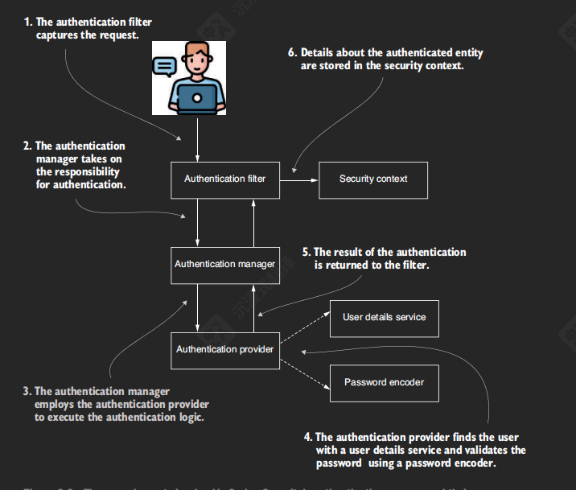
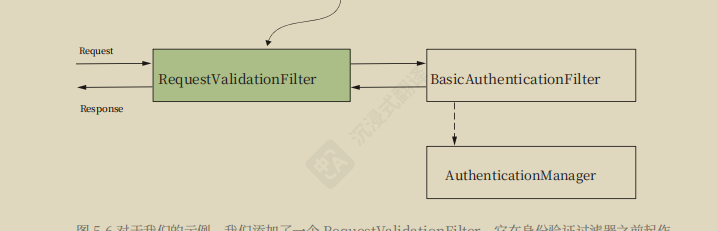
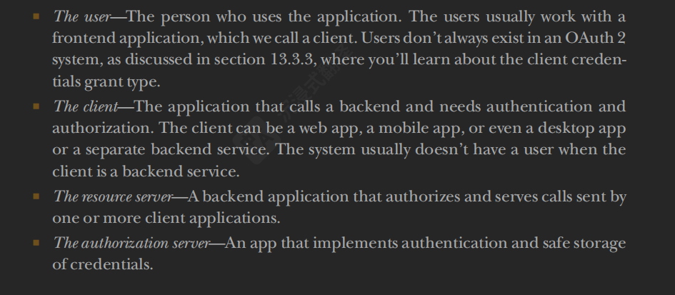
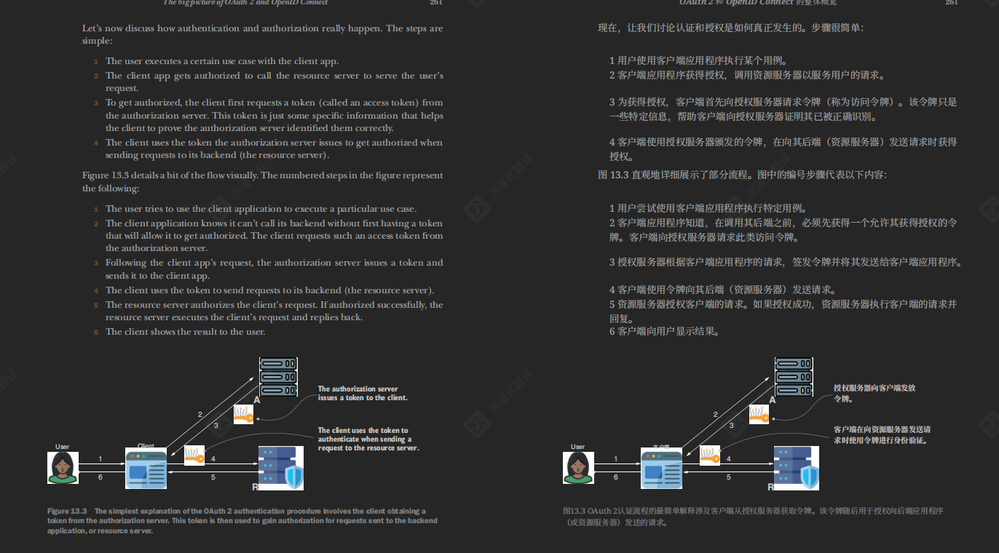

# SpringBoot

在pom依赖中管理springboot版本需要做以下说明

```xml
    <dependencyManagement>
        <dependencies>
  <!-- 其中只能是: springboot dependencies 
          不能是其他的: 不能是springboot-starter
          不能是: springboot-starter-parent
   -->
            <dependency>
                <groupId>org.springframework.boot</groupId>
                <artifactId>spring-boot-dependencies</artifactId>
                <version>${spring-boot.version}</version>
                <type>pom</type>
                <scope>import</scope>
            </dependency>
        </dependencies>

    </dependencyManagement>

```

然后在子模块中进行引入:

```xml
          <dependency>
                <groupId>org.springframework.boot</groupId>
                <artifactId>spring-boot-starter</artifactId>
          </dependency>
          <dependency>
            
          </dependency>
```

# 注解:

2025年10月14日

`@ConditionalOnMissBean`

`@ConditionOnProperty(prefix = '', name = '' , havingValue = '')`

`@Proflie({"default"})`

# 使用自动装配的逻辑:

写好配置类 按需加载特定的 bean对象

在resource/ META-INF/spring 文件夹中下面的:

`org.springframework.boot.autoconfigure.AutoConfiguration.imports`路径下面写好声明特定bean的全路径

然后 mvn clear install  在其他模块中引入自己写的的pom 依赖

# SpringSecurity



Interface : AuthenticationManager 的默认实现是: `ProviderManager`

其实在源码内部就能看出来了

他有 `private List<AuthenticationProvider> providers = Collections.emptyList()`;

```java
for (AuthenticationProvider provider : getProviders()) {
    if (!provider.supports(toTest)) {
        continue;
    }
    if (logger.isTraceEnabled()) {
        logger.trace(LogMessage.format("Authenticating request with %s (%d/%d)",
                                       provider.getClass().getSimpleName(), ++currentPosition, size));
    }
    try {
        result = provider.authenticate(authentication);
        if (result != null) {
            copyDetails(authentication, result);
            break;
        }
    }
```

默认去找数据库`DaoAuthenticationProvider`持有`userDetailService``PasswordEncoder`重写Authentication authenticate方法

当用户提交登录表单时，会生成一个 `UsernamePasswordAuthenticationToken`（此时是未认证的）。这个 Token 会被传递给 `AuthenticationManager`。

1. **进入 ProviderManager**：`ProviderManager.authenticate()` 被调用。
2. **遍历选择**：`ProviderManager` 会遍历其内部的 `providers` 列表，对每个 `Provider` 调用 `supports(Class<?> authentication)` 方法。
   * `DaoAuthenticationProvider` 的 `supports` 方法被设计为：只有当传入的 `authentication` 是 `UsernamePasswordAuthenticationToken` 类型时，才返回 `true`。
3. **委托认证**：一旦找到 `supports` 返回 `true` 的 `Provider`（即 `DaoAuthenticationProvider`），`ProviderManager` 就会调用该 `Provider` 的 `authenticate` 方法，将原始的未认证 `Token` 传给它。
4. **Provider 内部工作**：在 `DaoAuthenticationProvider.authenticate()` 中：
   * 从传入的 `authentication` 中获取用户名。
   * 调用 `userDetailsService.loadUserByUsername(username)` 来获取 `UserDetails` 对象（包含密码、权限等）。
   * 调用 `passwordEncoder.matches(提交的密码, UserDetails中的密码)` 来验证密码。
   * 如果密码正确，它会创建一个**已认证**的 `UsernamePasswordAuthenticationToken`，其中填充了用户的权限（`GrantedAuthority` 列表），并返回。
5. **返回结果**：这个已认证的 `Token` 会被逐层返回给最初的调用方（如 `UsernamePasswordAuthenticationFilter`），最终存入 `SecurityContextHolder`，完成登录。

# 再进行身份验证之前我要添加自定义的过滤器?该如何做



`BasicAuthenticationFilter`

http.addFilterBefore(new RequestValidationFilter(), BasicAuthenticationFilter.class);

```java
http.httpBasic(Customizer.withDefaults());
http.csrf(AbstractHttpConfigurer::disable);
http.addFilterBefore(new RequestValidationFilter(), BasicAuthenticationFilter.class);
//authorizeHttpRequests 指示了应用如何授权在特定端点上接收到的请求。
http.authorizeHttpRequests(auth -> auth
                           //                请求匹配器 / permitAll() 放行 None of the requests need to be authenticated.
                           .requestMatchers("/auth/test/**").permitAll()
                           // 放行所有登录相关接口（不管你是 /login 还是 /api/auth/login）
                           .requestMatchers(HttpMethod.POST, "/auth/test/login").permitAll()
                           .requestMatchers(HttpMethod.POST, "/api/auth/**").permitAll()
                           .requestMatchers(HttpMethod.GET, "/", "/error", "/favicon.ico", "/css/**", "/js/**", "/images/**").permitAll()
                           // 跨域预检也放行（必须！）
                           .requestMatchers(HttpMethod.OPTIONS, "/**").permitAll()
                           //                任何请求都要认证
                           .anyRequest().authenticated()
                          );
return http.build();
```

```powershell
C:\Users\ex_xutingquan>curl -H "request_id:1" http://localhost:4321/api/hello
{"timestamp":"2026-04-15 14:04:55","status":401,"error":"Unauthorized","path":"/api/hello"}
C:\Users\ex_xutingquan>curl -H "request_id:1" http://localhost:4321/api/hello
{"timestamp":"2026-04-15 14:05:36","status":401,"error":"Unauthorized","path":"/api/hello"}
C:\Users\ex_xutingquan>curl -H "request_id:1" http://localhost:4321/api/hello
{"timestamp":"2026-04-15 14:06:11","status":401,"error":"Unauthorized","path":"/api/hello"}
C:\Users\ex_xutingquan>curl -H "request_id:1" -u "xiaoxu:123456" http://localhost:4321/api/hello
```

# SpringSecurity OAuth2

资源拥有者 (Resource Owner) = 你自己

客户端 (Client)

授权服务器 (Authorization Server)

资源服务器 (Resource Server)

user  client  resource server  authentication server





申请的过程应该是 这样: 在获取 Access Token 之前, 要有授权码  Authentication Code

| **Resource Owner** | 患者 (你) | 拥有数据的人。 |
| --- | --- | --- |
| **Client** | 门诊科室 (心内科) | 想要访问数据的第三方应用。 |
| **Authorization Server** | 挂号处 / 认证中心 | 负责发“通行证”的权威机构。 |
| **Resource Server** | 检验科 / 档案室 | 存数据的地方，只认通行证不认人。 |
| **Access Token** | 就诊卡 / 二维码 | **核心中的核心！** 有时效的门票，丢了别人就能冒充你。 |
| **Scope** | 就诊卡上的权限 (如:仅限看心电图) | 限制第三方应用能看什么、不能看什么。 |
| **Grant Type** | 挂号方式 (现场排队 / 网上预约) | 获取 Token 的方式（最常见的是授权码模式）。 |
| **Consent Screen** | 知情同意书 | “是否允许XXX应用查看你的头像和昵称？” |

（A）用户打开客户端以后，客户端要求用户给予授权。

（B）用户同意给予客户端授权。

（C）客户端使用上一步获得的授权，向认证服务器申请令牌。

（D）认证服务器对客户端进行认证以后，确认无误，同意发放令牌。

（E）客户端使用令牌，向资源服务器申请获取资源。

（F）资源服务器确认令牌无误，同意向客户端开放资源。


> 更新: 2026-04-17 13:53:54  
> 原文: <https://www.yuque.com/alice-hv75k/mtczog/bcgh9obyouqkovln>