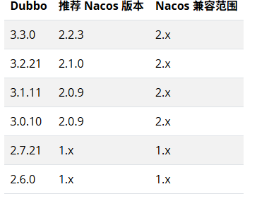

# Dubbo

1.使用Nacos作为注册中心实现自动服务发现

```xml
<dependency>
    <groupId>org.apache.dubbo</groupId>
    <artifactId>dubbo-spring-boot-starter</artifactId>
    <version>3.3.0</version>
</dependency>
<dependency>
    <groupId>org.apache.dubbo</groupId>
    <artifactId>dubbo-nacos-spring-boot-starter</artifactId>
    <version>3.3.0</version>
</dependency>
```

2.版本



3.配置并启用Nacos

```yaml
# application.yml (Spring Boot)
dubbo
 registry
   address: nacos://localhost:8848?username=nacos&password=nacos # 认证
   register-mode: instance
```

```yaml
# application.yml (Spring Boot)
dubbo:
 registry:
   address: nacos://localhost:8848?namespace=5cbb70a5-xxx-xxx-xxx-d43479ae0932 #命名空间
   register-mode: instance # 新用户请设置此值，表示启用应用级服务发现，可选值 interface、instance、all
   group: dubbo
```

<font style="color:rgba(33, 37, 41, 0.75);">如果不配置的话，group 是由 Nacos 默认指定。group 和 namespace 在 Nacos 中代表不同的隔离层次，通常来说 namespace 用来隔离不同的用户或环境，group 用来对同一环境内的数据做进一步归组</font>

<font style="color:rgba(33, 37, 41, 0.75);"></font>

<font style="color:rgba(33, 37, 41, 0.75);"></font>

<font style="color:rgba(33, 37, 41, 0.75);"></font>

<font style="color:rgba(33, 37, 41, 0.75);">使用dubbo的方式: 使用nacos注册中心,指定好协议;</font>

<font style="color:rgba(33, 37, 41, 0.75);">使用</font><code><font style="color:rgba(33, 37, 41, 0.75);">@DubboService</font></code><font style="color:rgba(33, 37, 41, 0.75);">标注生产者(注册到Nacos中)</font>

<font style="color:rgba(33, 37, 41, 0.75);">使用</font><code><font style="color:rgba(33, 37, 41, 0.75);">@DubboReference</font></code><font style="color:rgba(33, 37, 41, 0.75);">标注消费者 从nacos中拉取</font>

<font style="color:rgba(33, 37, 41, 0.75);">三大中心: 注册中心 , </font>**<font style="color:rgba(33, 37, 41, 0.75);">元数据中心</font>**<font style="color:rgba(33, 37, 41, 0.75);"> 配置中心</font>

<font style="color:rgba(33, 37, 41, 0.75);">参考Dubbo官方文档:</font>

<https://cn.dubbo.apache.org/zh-cn/overview/what/core-features/service-discovery/>

过程:

```plain
          ┌────────────────────────────────────────────┐
          │                Provider 启动                │
          └────────────────────────────────────────────┘
                             │
                             ▼
                ① 向注册中心(Nacos Registry)注册
             ┌──────────────────────────────────┐
             │ 服务名：org.xiaoxu.demo.DemoService │
             │ 实例：192.168.159.1:20880           │
             └──────────────────────────────────┘
                             │
                             ▼
                ② 向配置中心(Nacos Config)上报元数据
             ┌──────────────────────────────────────────┐
             │ DataID: org.xiaoxu.demo.DemoService:...   │
             │ 内容：方法签名、版本、序列化、参数类型等     │
             └──────────────────────────────────────────┘
                             │
                             ▼
                ③ 消费者启动（@DubboReference）
                             │
                → 从注册中心获取服务列表 (IP+端口)
                → 从配置中心读取接口元数据
                             │
                             ▼
                     调用 RPC 成功

```


> 更新: 2025-11-07 09:05:35  
> 原文: <https://www.yuque.com/alice-hv75k/mtczog/ycmyseg6cydihed6>