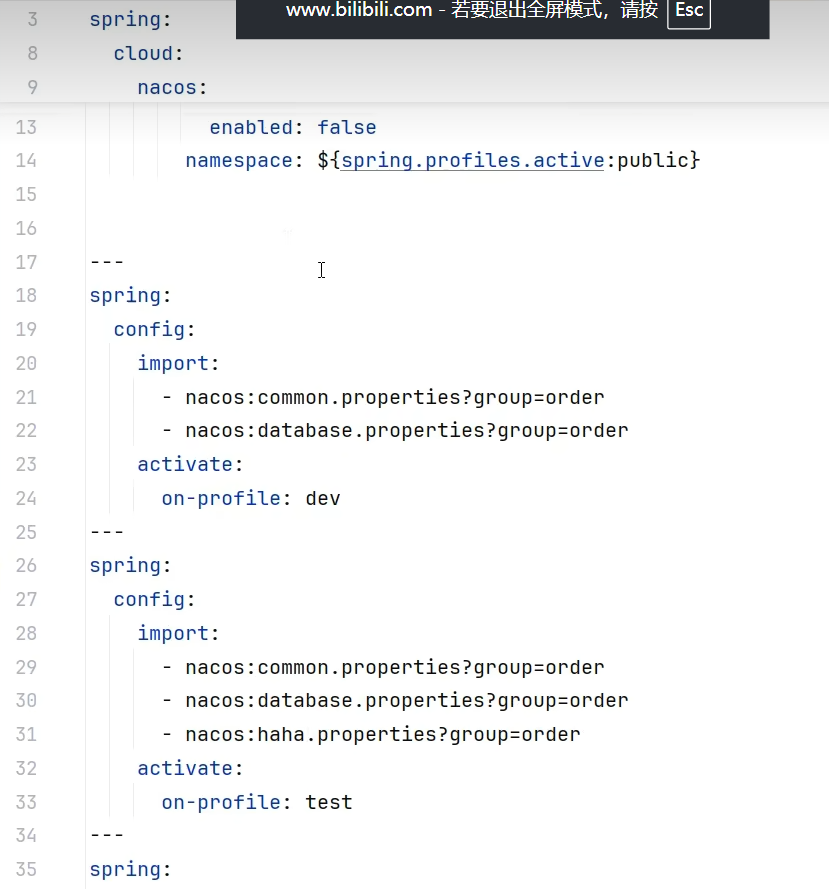

# Nacos

首先了解概念:

# 服务发现:

* 服务注册: 客户端实例注入到Nacos Server 中 并进行心跳检测.
* 服务发现: 其他服务想要调用的时候 去Nacos Server中进行遍历 缓存到本地 进行调用

还有配置中心

实时更新相关配置文件

`service` 服务名称

`instance` 服务实例

`Group` 区分不同的环境 用于隔离环境

`NameSpace` 用于隔离不同环境配置和服务(dev/prod/test)

`Cluster`集群/同一个服务下

实战演示:

依赖配置:

```xml
<?xml version="1.0" encoding="UTF-8"?>
<project xmlns="http://maven.apache.org/POM/4.0.0"
  xmlns:xsi="http://www.w3.org/2001/XMLSchema-instance"
  xsi:schemaLocation="http://maven.apache.org/POM/4.0.0 http://maven.apache.org/xsd/maven-4.0.0.xsd">

  <parent>
    <groupId>org.springframework.boot</groupId>
    <artifactId>spring-boot-starter-parent</artifactId>
    <version>3.3.4</version>
    <relativePath/> <!-- lookup parent from repository -->
  </parent>
  <modelVersion>4.0.0</modelVersion>

  <groupId>org.xiaoxu</groupId>
  <artifactId>spring-cloud-demo</artifactId>
  <version>1.0-SNAPSHOT</version>
  <packaging>pom</packaging>

  <properties>
    <maven.compiler.source>17</maven.compiler.source>
    <maven.compiler.target>17</maven.compiler.target>
    <project.build.sourceEncoding>UTF-8</project.build.sourceEncoding>
    <spring-cloud.version>2023.0.3</spring-cloud.version>
    <spring-cloud-alibaba.version>2023.0.3.2</spring-cloud-alibaba.version>
  </properties>
  <dependencyManagement>
    <dependencies>
      <dependency>
        <groupId>org.springframework.cloud</groupId>
        <artifactId>spring-cloud-dependencies</artifactId>
        <version>${spring-cloud.version}</version>
        <type>pom</type>
        <scope>import</scope>
      </dependency>
      <dependency>
        <groupId>com.alibaba.cloud</groupId>
        <artifactId>spring-cloud-alibaba-dependencies</artifactId>
        <version>${spring-cloud-alibaba.version}</version>
        <type>pom</type>
        <scope>import</scope>
      </dependency>
    </dependencies>
  </dependencyManagement>

</project>
```

单独微服务:得pom

```xml
<dependencies>
    <dependency>
        <groupId>com.alibaba.cloud</groupId>
        <artifactId>spring-cloud-starter-alibaba-nacos-discovery</artifactId>
    </dependency>
</dependencies>
```

application.yml

```yaml
spring:
  cloud:
    nacos:
      discovery:
        server-addr:
      config:
        server-addr:
          
```

```yaml
spring:
  cloud:
    nacos:
      discovery:
        server-addr: ${nft.turbo.nacos.server.url}
      config:
        server-addr: ${nft.turbo.nacos.server.url}
        file-extension: properties
        name: ${spring.application.name}

```

# 配置中心生效:

spring.config.import: "nacos:dataId"

如果不想让配置中心生效的话:

```properties
使用配置: 
spring.cloud.nacos.config.import-checked-enabled=false
```

如果想要配置动态刷新: 使用@RefreshScope 注解

## namespace group 等区分

namespace 用来区分多环境 如: dev prod test

group 用来区分多服务 如: order  user product

dataid 用来区分多配置 不同的配置比如common.yml db.yml



# Springcloud Gateway

其中路由转发的规则:

```xml
spring:
  cloud:
    gateway:
      routes:
        - id: user_service
          uri: lb://user_service
          predicates:
            - Path=/user/**
        - id: order_service
          uri: lb://order_service
          predicates:
            - Path=/order/**
```

其中Gateway端口:16888

user服务端口: 28000

order服务端口: 8080

在user中的所有以/user/\*\* 开头的路径

都能用: http://localhost:16888/user/xxx 访问

这样就转发到了: http://localhost:28000/user/xxx


> 更新: 2025-10-18 18:07:31  
> 原文: <https://www.yuque.com/alice-hv75k/mtczog/kwem37rtf27y05he>