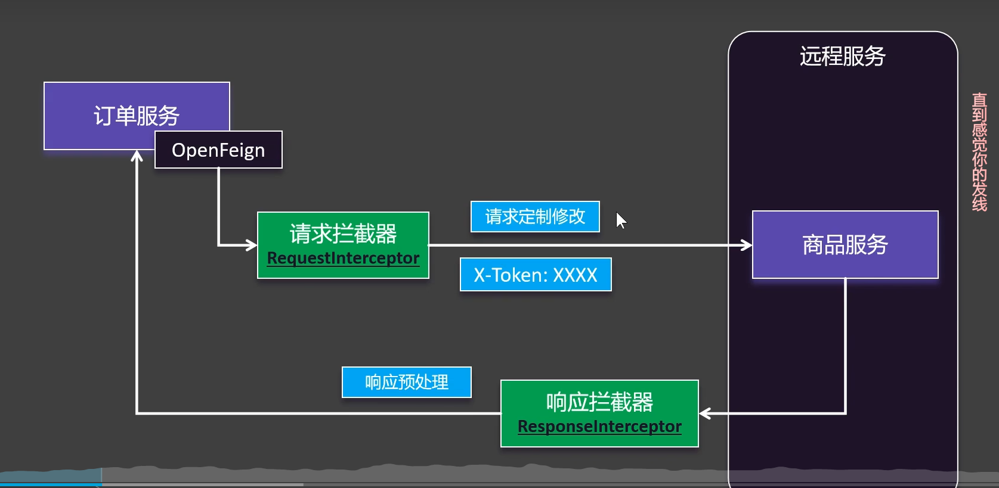

# OpenFeign




拦截器是 请求拦截器和 相应拦截器


```java
@Component
public class TokenInceptor implements RequestInterceptor {
    @Override
    public void apply(RequestTemplate requestTemplate) {
        requestTemplate.header("token", UUID.randomUUID().toString());
    }
}
```


> 更新: 2025-10-13 08:56:17  
> 原文: <https://www.yuque.com/alice-hv75k/mtczog/tnxcaotb5i60uh6h>