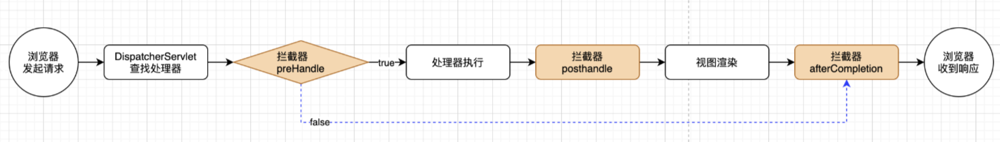
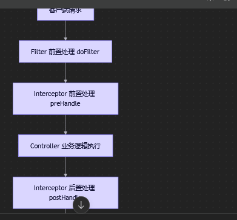
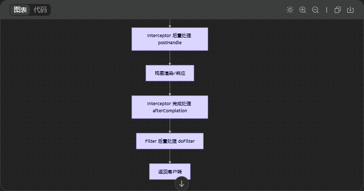
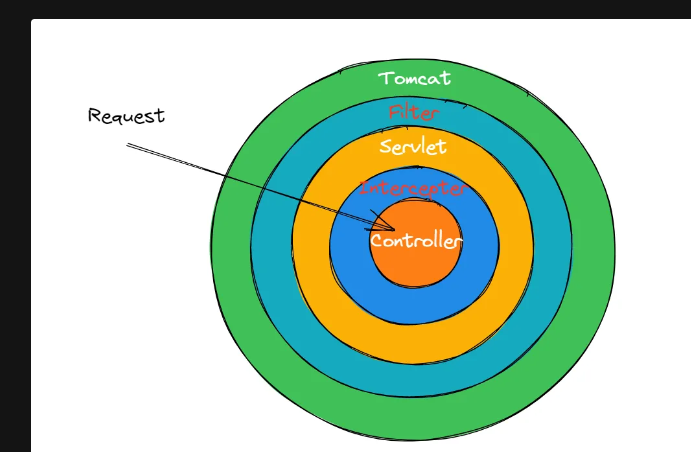
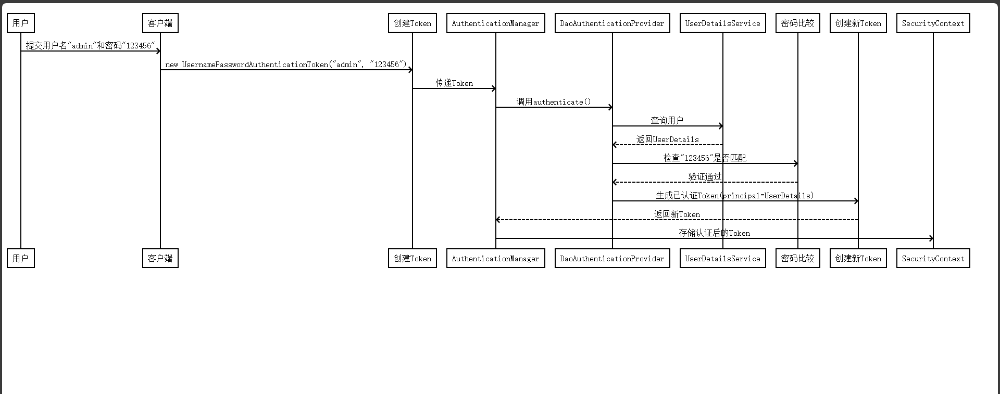

# web

# 拦截器





mvc拦截器的执行流程: 



Filter是Servlet规范的一部分

Interceptor是SpringMVC 提供的功能;

SpringSecurity的流程:



```java
    public static void setLoginUser(LoginUser loginUser, HttpServletRequest request) {
        // 创建 Authentication，并设置到上下文
        Authentication authentication = buildAuthentication(loginUser, request);
        SecurityContextHolder.getContext().setAuthentication(authentication);

        // 额外设置到 request 中，用于 ApiAccessLogFilter 可以获取到用户编号；
        // 原因是，Spring Security 的 Filter 在 ApiAccessLogFilter 后面，在它记录访问日志时，线上上下文已经没有用户编号等信息
        if (request != null) {
            WebFrameworkUtils.setLoginUserId(request, loginUser.getId());
            WebFrameworkUtils.setLoginUserType(request, loginUser.getUserType());
        }
    }

    private static Authentication buildAuthentication(LoginUser loginUser, HttpServletRequest request) {
        // 创建 UsernamePasswordAuthenticationToken 对象
        UsernamePasswordAuthenticationToken authenticationToken = new UsernamePasswordAuthenticationToken(
                loginUser, null, Collections.emptyList());
        authenticationToken.setDetails(new WebAuthenticationDetailsSource().buildDetails(request));
        return authenticationToken;
    }
```


```yaml
当一个请求到达时，Spring Security按以下顺序检查：

1. 1.
   第一层检查 ：是否匹配静态资源、@PermitAll注解或配置文件中的免认证URL？
   
   - ✅ 匹配 → 直接放行
   - ❌ 不匹配 → 进入第二层
2. 2.
   第二层检查 ：是否匹配自定义规则中的URL？
   
   - ✅ 匹配 → 按自定义规则处理（通常也是放行）
   - ❌ 不匹配 → 进入第三层
3. 3.
   第三层检查 ：兜底规则
   
   - 异步请求 → 放行
   - 其他所有请求 → 必须认证
这种设计的好处是：

- 分层清晰 ：不同类型的权限控制分开管理
- 易于扩展 ：每个模块可以定义自己的自定义规则
- 安全性高 ：默认拒绝，明确允许的才放行
```


springsecurity流程: 

1. 通过AuthenticationManger接口进行身份验证
2. ProviderManger 是 AuthenticationManger的一个默认实现
3. ProviderManger把验证工作委托给AuthenticationProvider接口
4. AuthenticationProvider实现类DaoAuthenticationProvider会检查身份认证
5. DaoAuthenticationProvider又把认证工作委托给UserDetailsService接口
6. 自定义UserDetailService接口从数据库中获取用户账号/密码信息,封装成UserDetails返回
7. 使用Security自定义AuthenticationProvider接口,获取用户输入账号,密码 并封装成Authentication接口
8. 将UserDetails和Authentication进行比对,如果一致就返回,UsernamePasswordAuthenticationToken 否则就抛出异常;


> 更新: 2026-04-10 13:52:52  
> 原文: <https://www.yuque.com/alice-hv75k/mtczog/kgcvqxxvygyushux>