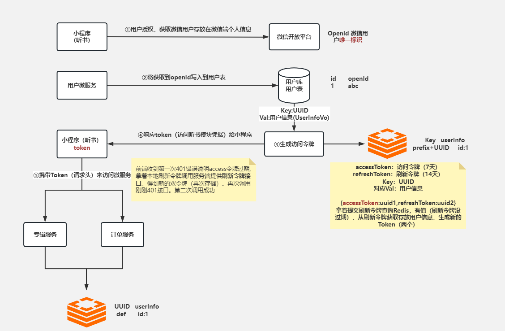
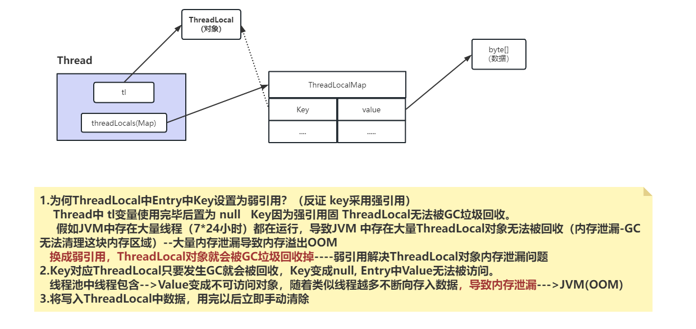

# 听书总结:

### 1.登录:

> 有些接口可以免登录,首页专辑数据 专辑详情   
购买vip  专辑 声音 播放进度 收藏声音 支付....  
采用微信登录实现登录功能,首次登录:利用Kafka完成账户的余额初始化
>
> 1.显得到微信登录接口的临时票据:code  
2. 小程序将code 请求 服务端,根据code获取到微信用户  
存在微信唯一表示:openid,得到openid说明微信账户合法  
为用户生成令牌,将令牌存入Redis设置过期时间,将生成的token相应给小程序端  
,小程序存放token,只要登录小程序必须携带token来访问
>
> 方法上加注入自定义注解: 如果该方法时需要登录,得到请求头中的token,  
根据token查询redis获取用户id,将得到的用户id放入到ThreadLocal中,  
后续只要在当年线程内就随时获取到用户id,处理到不用业务
>
> 
>
> 技术:  
微信JavaSDK  
自定义注解:  
环绕通知+ AOP切面 : 切点: 通过对自定义注解进行增强,获取上下文  
请求对象:RequestContextHolder,通过类型转化成:ServletRequest  
获取到请求token 根据token 获取Redis中的用户信息,必须登录的话:  
根据token 未查询用户信息,相应未认证异常,前端引导登录,  
Redis里面由信息:将用户id放入到ThreadLocal中 使用完之后手动清理,  
防止内存泄露
>
> 
>
> 令牌续期实现方案:  
设置阈值  
//设置token无感刷新  
 Long expire = redisTemplate.getExpire(RedisConstant.USER_LOGIN_KEY_PREFIX + token);  
 if (expire<3600){  
     redisTemplate.expire(RedisConstant.USER_LOGIN_KEY_PREFIX,7, TimeUnit.DAYS);  
 }
>

### 2.ThreadLocal

> 更新: 2024-09-04 13:45:23  
> 原文: <https://www.yuque.com/alice-hv75k/mtczog/ww0gzf2467kgb99g>