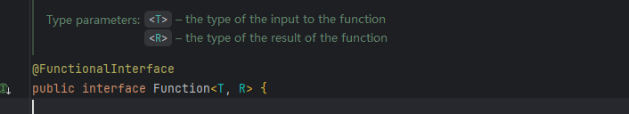
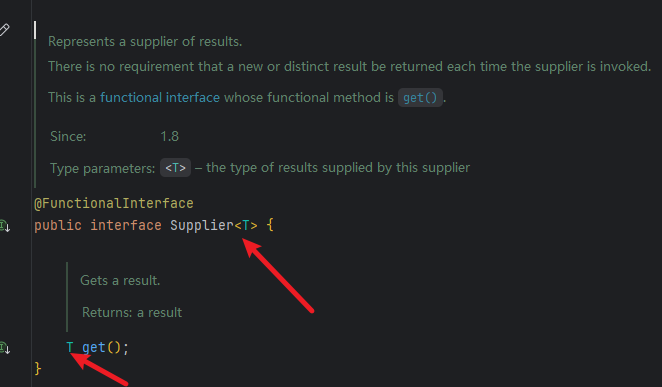
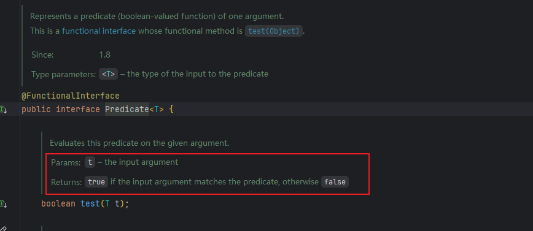

# 容易混淆的遗忘的点:

泛型方法:

```plain
[访问修饰符] <类型参数列表> 返回类型 方法名([参数列表]) {
    // 方法体
}
```

在函数时接口的时候:

调用相关的方式总是迷

来搞清楚怎么使用Lambda

1. `Function` 函数时接口: 就是将一个类型变成另外一个类型的



其实他说的很清晰了

流中的map 用了Function作为参数

2. `supplier`接口



没有参数却能拿到你想要的那个类型

3. `predicate`接口 判断某一条件是否满足 是否成立



还是看注释 其中流中 filter就 把Predicate当作参数了

4. 当需要输入两个参数,最后返回一个结果的时候就考虑使用: BiFunction\<T,U,R>
5. <font style="color:rgba(0, 0, 0, 0.86);">当你需要对两个相同类型的对象进行操作，并返回同类型的结果 </font>

```plain
BinaryOperator
```

Maven:

注意lombok + MapStruct的使用:

二者都是在编译器进行处理的,要求在配置maven插件的时候要配置好`<annotationProcessorPaths>`确保lombok在MapStruct之前,因为MapStruct生成的东西需要在get/set方法,

使用MapStruct只需要 本体就行;

而真正映射的却是: mapstruct-processor

以下是示例:

```xml
<plugin>
  <groupId>org.apache.maven.plugins</groupId>
  <artifactId>maven-compiler-plugin</artifactId>
  <version>3.11.0</version>
  <configuration>
    <source>21</source>
    <target>21</target>
    <annotationProcessorPaths>
      <path>
        <groupId>org.projectlombok</groupId>
        <artifactId>lombok</artifactId>
        <version>1.18.30</version>
      </path>
      <path>
        <groupId>org.mapstruct</groupId>
        <artifactId>mapstruct-processor</artifactId>
        <version>1.5.5.Final</version>
      </path>
    </annotationProcessorPaths>
  </configuration>
</plugin>
```

JSON问题扫盲

首先{} 这叫JSON对象

```json


{

  "name" : "xtq",
  "age" : 23
  
}
```

其次\[]这叫json数组  约等于: List<T>

```json
[
  {"name": "张三", "age": 20},
  {"name": "李四", "age": 22}
]
```

普通字段 → 直接 key: value

嵌套对象 → JSON 里就是 {}，前端是 Object，后端是一个 Java 类

List<对象> → JSON 里是 \[{}, {}]，前端是数组，后端用 List<XxxDTO>

List<String> → JSON 里是 \["a", "b"]，前端是 string\[]，后端用 List<String>

代理也是一个对象

他其中持有一个原始对象的引用! 只不过代理对象在执行前后可以执行特定的业务逻辑,然后真是的方法执行还是调用的原始兑现的逻辑!!!

比如

Original original = new Orignial();

Proxy proxy = new Proxy(orignial);\`\`


> 更新: 2026-04-16 16:51:58  
> 原文: <https://www.yuque.com/alice-hv75k/mtczog/wrpx3mmr4bpuuemd>