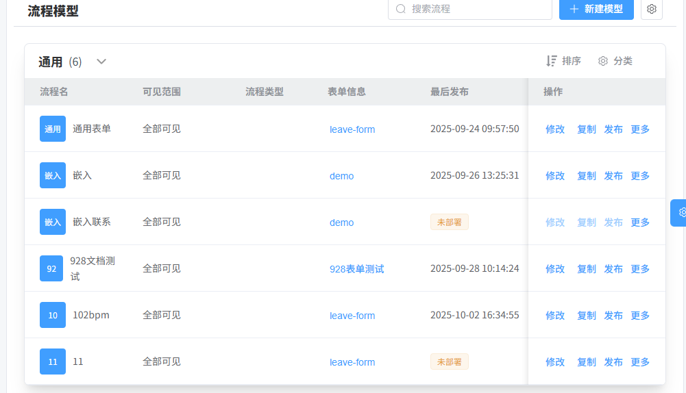

# 工作流

```graphql
graph TD
A[流程分类] -->|分类管理| B[流程模型]
B -- 部署 --> C[流程定义]
C -- 用户发起 --> D[流程实例]
D -- 执行节点 --> E[流程任务
```

---

## 流程分类
BpmCategoryController

涉及的实体: BpmCategoryDO

涉及的表结构: bpm_category

```sql
CREATE TABLE `bpm_category` (
  `id` bigint(20) NOT NULL AUTO_INCREMENT COMMENT '分类编号',
  `name` varchar(30) COLLATE utf8mb4_unicode_ci DEFAULT '' COMMENT '分类名',
  `code` varchar(30) COLLATE utf8mb4_unicode_ci DEFAULT '' COMMENT '分类标志',
  `description` varchar(255) COLLATE utf8mb4_unicode_ci NOT NULL DEFAULT '' COMMENT '分类描述',
  `status` tinyint(4) DEFAULT NULL COMMENT '分类状态',
  `sort` int(11) DEFAULT NULL COMMENT '分类排序',
  `creator` varchar(64) COLLATE utf8mb4_unicode_ci DEFAULT '' COMMENT '创建者',
  `create_time` datetime NOT NULL DEFAULT CURRENT_TIMESTAMP COMMENT '创建时间',
  `updater` varchar(64) COLLATE utf8mb4_unicode_ci DEFAULT '' COMMENT '更新者',
  `update_time` datetime NOT NULL DEFAULT CURRENT_TIMESTAMP ON UPDATE CURRENT_TIMESTAMP COMMENT '更新时间',
  `deleted` bit(1) NOT NULL DEFAULT b'0' COMMENT '是否删除',
  `tenant_id` bigint(20) NOT NULL DEFAULT '0' COMMENT '租户编号',
  PRIMARY KEY (`id`) USING BTREE
) ENGINE=InnoDB AUTO_INCREMENT=1 DEFAULT CHARSET=utf8mb4 COLLATE=utf8mb4_unicode_ci ROW_FORMAT=DYNAMIC COMMENT='BPM 流程分类'
```

```java
public class BpmCategoryDO extends BaseDO {

    /**
     * 分类编号
     */
    @TableId
    private Long id;
    /**
     * 分类名
     */
    private String name;
    /**
     * 分类标志
     */
    private String code;
    /**
     * 分类描述
     */
    private String description;
    /**
     * 分类状态
     *
     */
    private Integer status;
    /**
     * 分类排序
     */
    private Integer sort;

}
```

--------------- --------------------------------------------------------------------------------------------

流程分类的接口: 

```java
-- 流程编号获取流程分类
/admin-api/bpm/category/get?id = ?
/admin-api/bpm/category/page 
-- 获取流程分类的精简信息列表(做了一个控制就是状态开启的)
/admin-api/bpm/category/page/simple-list
```


## 流程模型:
涉及的数据库表: act_re_model  act_ge_bytearray

涉及的实体类: Model BpmFormDO BpmCategoryDO Deployment BpmProcessDefinition User Dept




```java
/admin-api/bpm/model/list   --- 获取流程分页

 --- 部署模型
/admin-api/bpm/model/deploy


--- 
```


## 表单菜单: 


```java
/admin-api/bpm/form/simple-list
```


> 更新: 2025-10-09 16:29:57  
> 原文: <https://www.yuque.com/alice-hv75k/mtczog/xc9ztoc3g4qspf4g>