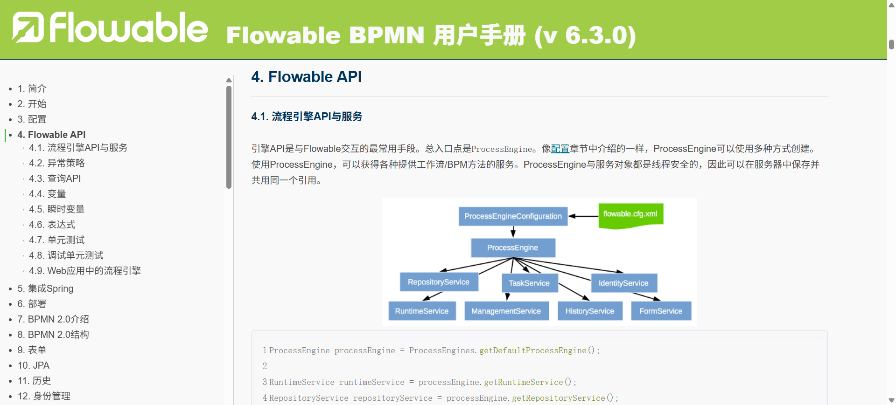

# 工作流 Flowable

流程详见: [https://tkjohn.github.io/flowable-userguide/](https://tkjohn.github.io/flowable-userguide/)

RepositoryService : 提供了管理与控制部署(deployments)与流程定义(process definitions)的操作

RuntimeService : RuntimeService也用于读取与存储流程变量。流程变量是流程实例中的数据，可以在流程的许多地方使用

TaskService: 核心是需要人类用户操作的任务。所有任务相关的东西都组织在TaskService中

- [ ] 查询分派给用户或组的任务创建独立运行(standalone)任务。这是一种没有关联到流程实例的任务。
- [ ] 决定任务的执行用户(assignee)，或者将用户通过某种方式与任务关联。
- [ ] 认领(claim)与完成(complete)任务。认领是指某人决定成为任务的执行用户，也即他将会完成这个任务。完成任务是指“做这个任务要求的工作”，通常是填写某个表单。

HistoryService:暴露Flowable引擎收集的所有历史数据。当执行流程时，引擎会保存许多数据（可配置），例如流程实例启动时间、谁在执行哪个任务、完成任务花费的事件、每个流程实例的执行路径，等等。这个服务主要提供查询这些数据的能力。

> 更新: 2026-03-31 19:57:02  
> 原文: <https://www.yuque.com/alice-hv75k/mtczog/phy08hm8gva9v3hc>