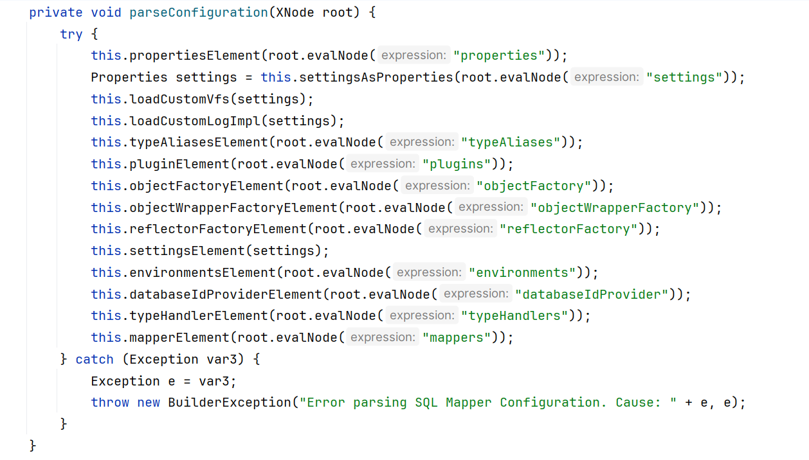
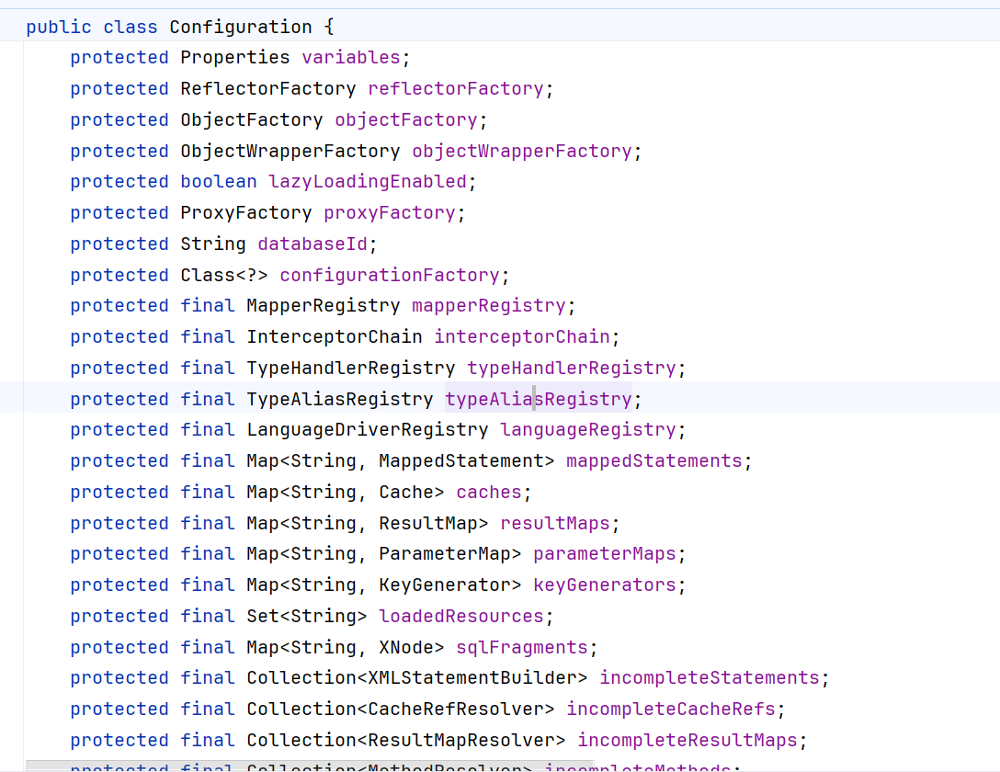

# 数据库MyBatis

使用

```xml
<![CDATA[文本内容]]>
```

能够处理 转义字符出现的问题

来吧:MyBatis! 让其他人的嘲讽,化作自己的前进的动力!

\#和$的区别?

${}是properties文件中的变量占位符,它可以用与属性值和sql内部,属于原样文本替换,可以替换任意内容,

\#{}是sql的参数占位符,MyBatis会将sql的#{}替换为? sql执行前会使用PrepareStatement的参数设置方法,按序给sql 的?号占位符设置参数值

\#{item.name}的取值方式为使用反射从参数对象中获取item对象的name属性值,相当于param.getItem().getName();

> \#{}是预编译处理,${}是字符串替换
>
> MyBatis在处理#{}时,会将sql中的#{}替换为?号,调用PrepareStatement的set方法来赋值
>
> MyBatis在处理${}时,就是把${}替换成变量的值
>
> 使用#{}可以有效的防止SQL注入,提高系统安全性.

# JDBC完整的交互过程

1. 加载数据库驱动
2. 获取数据库的连接(URL,username,password)
3. 定义sql语句

> Statement:用来执行SQL查询和更新(针对静态SQL语句和单次执行)
>
> PreparedStatement:用来执行动态参数的SQL查询和更新(预编译)
>
> ResultSet:用来存储数据库查询操作返回的结果.

4. 通过数据库连接,创建Statement对象或者PreparedStatement对象
5. 通过Statement对象执行sql语句,得到结果集ResultSet对象
6. 读取ResultSet对象,转换成我们要的JavaBean
7. 关闭数据库连接,Statement,ResultSet等对象,释放相关资源.

> JDBC缺点?
>
> 1. 每一次CRUD,建立连接,关闭连接,频繁获取关闭连接,会造成数据库资源的浪费,(数据库连接池管理数据库连接)
> 2. sql语句硬编码,sql语句修改,重新遍历Java代码,不利于系统维护(sql语句可以配置化,比如设置到xml文件中)
> 3. Resultset遍历结果集,对表的字段存在硬编码,不利于系统维护(结果集自动映射到Java对象中?)
> 4. 重复代码特别多?建立,加载驱动?(设想:抽取封装公共代码)
> 5. 没有缓存?

**有那么多缺点ORM应运而生!**

***

# MyBatis使用流程

1. 创建与表对应的实体类
2. 编写mybatis-config.xml配置文件
3. 定义实体类表的映射文件
4. 向核心配置文件中注册映射文件

> <mappers>
>
> <mapper resource= "映射文件的全类名">
>
> </mappers>

## SqlSessionFactory创建流程

```java
InputStream resourceAsStream = Resources.getResourceAsStream("Mybatis-config.xml");

sqlSessionFactory build = new SqlSessionFactoryBuilder().build(resourceAsStream);
```

1. getResourceAsStream读取配置文件`mybatis-config.xml`
2. 获取SqlSessionFactoryBulider,调用bulid方法创建SqlSession
3. 其中bulid方法内部使用<code><font style="color:#080808;background-color:#ffffff;">XMLConfigBuilder</font></code><font style="color:#080808;background-color:#ffffff;">来解析XML配置文件</font>
4. <font style="color:#080808;background-color:#ffffff;">接着</font><code><font style="color:#080808;background-color:#ffffff;">XMLConfigBuilder</font></code><font style="color:#080808;background-color:#ffffff;">里面的parse()方法!返回的时parseConfiguration方法也就是解析</font><code><font style="color:#080808;background-color:#ffffff;">mybatis-config.xml</font></code><font style="color:#080808;background-color:#ffffff;">中的</font>

`<configuration>`标签!!!

```java
    public Configuration parse() {
        if (this.parsed) {
            throw new BuilderException("Each XMLConfigBuilder can only be used once.");
        } else {
            this.parsed = true;
            this.parseConfiguration(this.parser.evalNode("/configuration"));
            return this.configuration;
        }
    }

    private void parseConfiguration(XNode root) {
```



```xml
<configuration>


  <settings>
    <setting name="mapUnderscoreToCamelCase" value="true"/>
    <setting name="logImpl" value="STDOUT_LOGGING"/>
  </settings>


  <typeAliases>
    <!--单独起名-->
    <!--  <typeAlias type=""/>-->
    <!--批量给别名，别名就是类的首字母小写-->
    <package name="com.xiaoxu.pojo"/>
  </typeAliases>

  <plugins>
    <plugin interceptor="com.github.pagehelper.PageInterceptor">
      <property name="helperDialect" value="mysql"/>
    </plugin>
  </plugins>

  <environments default="development">
    <!-- environment表示配置Mybatis的一个具体的环境 -->
    <environment id="development">
      <!-- Mybatis的内置的事务管理器 -->
      <transactionManager type="JDBC"/>
      <dataSource type="POOLED">
        <!-- 建立数据库连接的具体信息 -->
        <property name="driver" value="com.mysql.cj.jdbc.Driver"/>
        <property name="url" value="jdbc:mysql://localhost:3306/mybatis"/>
        <property name="username" value="root"/>
        <property name="password" value="123456"/>
      </dataSource>
    </environment>
  </environments>
  <!--   mapper resource 要写的是SQL映射的配置文件-->
  <!--mapper package name:
  如果以包的方式引入映射文件，满足两个条件
  1.mapper接口和映射文件的包必须一致 其中要注意目录格式/
  2.mapper接口的名字和映射文件的名字必须一致
  -->
  <mappers>
    <!--     <mapper resource=""/>-->
    <package name="com.xiaoxu.mapper"/>
  </mappers>
</configuration>
```

5. 解析完毕对象后放在了`Configuration`对象中
6. 
7. 这个时候不光`mybatis-config.xml`文件内容,还包括`xxxMapper.xml`的内容
8. 这个时候拿着build方法config new出一个DefaultSqlSessionFactory

```java
public SqlSessionFactory build(Configuration config) {
return new DefaultSqlSessionFactory(config);
}
```

```java
public DefaultSqlSessionFactory(Configuration configuration) {
this.configuration = configuration;
}
```

9. 至此SqlSessionFactory创建完毕

## SqlSession的使用流程:

1. 常规需要使用拼接statement方式;
2. xxxMapper.interface接口代理方式;

# 在MyBatis中开启日志;

纯mybatis

```xml
<settings>
  <setting name="logImpl" value="log4j"/>
</settings>
```

```properties
# Global logging configuration
log4j.rootLogger=DEBUG, stdout
# Console output...
log4j.appender.stdout=org.apache.log4j.ConsoleAppender
log4j.appender.stdout.layout=org.apache.log4j.PatternLayout
log4j.appender.stdout.layout.ConversionPattern=%5p [%t] - %m%n

#输出到日志文件
#log4j.appender.file=org.apache.log4j.FileAppender
#log4j.appender.file.File=../logs/iask.log
#log4j.appender.file.layout=org.apache.log4j.PatternLayout
#log4j.appender.file.layout.ConversionPattern=%d{yyyy-MM-dd HH:mm:ss}  %l  %m%n
```

配合SpringBoot: 且使用了mp 那就要吧该配置配置到mp下面,配置到mybatis没有作用

```yaml
mybatis:
  configuration:
    # 指定 MyBatis 使用标准输出（StdOut）打印日志
    log-impl: org.apache.ibatis.logging.stdout.StdOutImpl
    
    
logging:
  level:
    # 将你的 Mapper 接口所在的包路径设置为 DEBUG 级别
    com.example.mapper: debug    
```


> 更新: 2026-04-11 15:36:47  
> 原文: <https://www.yuque.com/alice-hv75k/mtczog/iyw3ly97gwagsvcy>