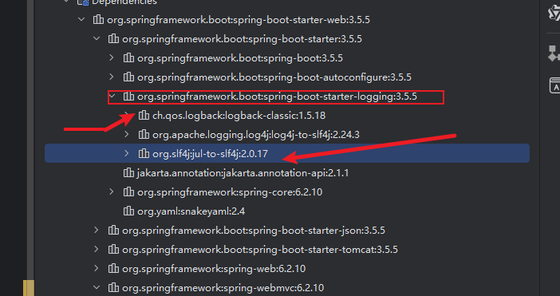
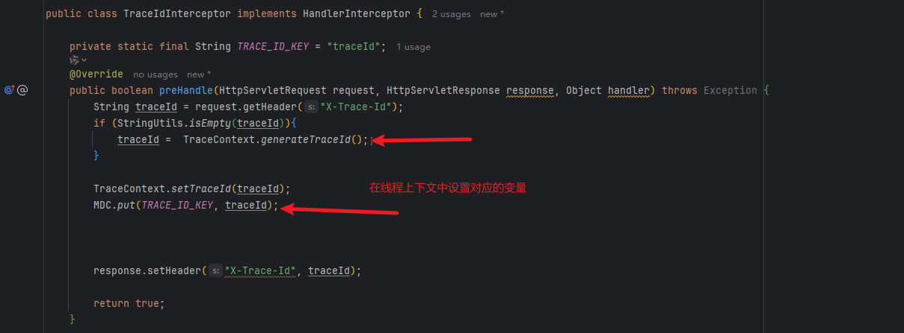
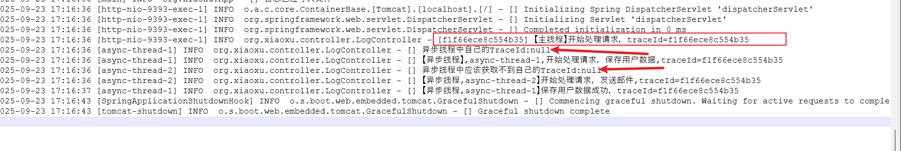
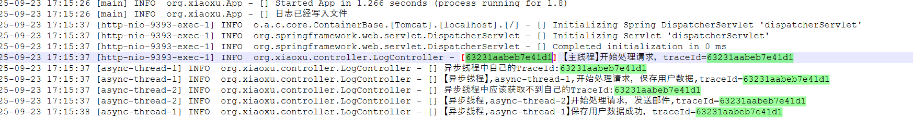

# 日志

# 使用Logback+SLF4J

使用门面系统

1. 门面: SLF4J
2. 框架 Logback

引入spring-boot-starter-web 之后自带门面+日志: 如图:



图1-1

# 使用traceId在上下文中追踪日志记录

1. 在web拦截器中实现:`HandlerInterceptor`接口 重写`preHandle`方法 和 `afterCompletion`

其中逻辑主要有: 在请求头中获取traceId, 如果没有就设置,然后放到response中 设置到MDC中 然后放行



图2-1

注意要在请求完毕之后清除线程变量 MDC.clear() 和 线程上下文中的remove()

2. 在线程中进行设置TraceId的时候要注意: 利用`TransmittableThreadLocal`来初始化ThreadLocal
3. 配置线程池的时候要注意:

```java
@Bean("threadPoolTaskExecutor")
public Executor threadPoolTaskExecutor(){
    ThreadPoolTaskExecutor executor =  new ThreadPoolTaskExecutor();
    executor.setCorePoolSize(5);
    executor.setMaxPoolSize(10);
    executor.setQueueCapacity(100);
    executor.setThreadNamePrefix("async-thread-");
    // ✅ 关键：使用 TTL 包装线程池
    //它的作用是将当前线程的 TransmittableThreadLocal 上下文捕获并包装到 Runnable 任务中
    executor.setTaskDecorator(TtlRunnable::get);
    executor.initialize(); //不建议省略
    return executor;
}

```

注意TransmittableThreadLocal 再进行传递到时候: 是传递的线程间的变量一定要明白是线程间的变量

而Lambda表达式中的变量本身就满足: effectively final 类型

如果不使用: TransmittableThreadLocal进行线程传递的话: 在异步线程中获取的变量就是null 如图:



图2-2

反之就能看到变量信息:



图2-3

# logback-spring.xml 文件解析:

`<configuration>`:根节点,所有的配置项目都要包含其中;

`<property>`: 定义变量 后续方便引用;

`<appender>` 定义日志的输出目的地;

```xml
<!-- ================================== -->
<!-- 2. 控制台 Appender -->
<!-- ================================== -->
<appender name="CONSOLE" class="ch.qos.logback.core.ConsoleAppender">
  <encoder>
    <pattern>${CONSOLE_PATTERN}</pattern>
    <charset>UTF-8</charset>
  </encoder>
</appender>
```

```xml
<!-- ================================== -->
<!-- 输出到 logs/user-controller.log，并按天滚动 -->
<!-- ================================== -->
<appender name="USER_CONTROLLER_FILE" class="ch.qos.logback.core.rolling.RollingFileAppender">
  <!-- 日志文件路径 -->
  <file>${LOG_PATH}/user-controller.log</file>

  <!-- 滚动策略：基于时间 + 大小 -->
  <rollingPolicy class="ch.qos.logback.core.rolling.SizeAndTimeBasedRollingPolicy">
    <!-- 归档日志文件名格式：每天一个文件 -->
    <fileNamePattern>${LOG_PATH}/archived/user-controller-%d{yyyy-MM-dd}.%i.gz</fileNamePattern>
    <!-- 保留最近 30 天的历史文件 -->
    <maxHistory>30</maxHistory>
    <!-- 单个文件最大 10MB，超过则切分 -->
    <maxFileSize>10MB</maxFileSize>
  </rollingPolicy>

  <!-- 日志格式 -->
  <encoder>
    <pattern>%d{yyyy-MM-dd HH:mm:ss} [%thread] %-5level %logger{50} - %msg%n</pattern>
  </encoder>
</appender>
```

`<logger>`为特定的包或者类配置日志级别和输出方式;

```xml
<!-- 设置 MyService 类的日志级别为 DEBUG -->
<logger name="com.example.MyService" level="DEBUG" additivity="false">
  <appender-ref ref="FILE"/>
</logger>
```

`<root>`全局根Logger,所有未单独配置的类都遵循此约定;

```xml
<!-- ================================== -->
<!-- 5. 根日志器（用于其他所有类） -->
<!-- 示例：只记录 INFO 及以上级别 -->
<!-- ================================== -->
<root level="INFO">
  <appender-ref ref="CONSOLE"/>
  <appender-ref ref="USER_CONTROLLER_FILE"/>
  <!-- 其他业务日志可以加 FILE、ASYNC 等 -->
</root>
```

`<SpringbootProfile>`

```xml
<!-- 开发环境 -->
<springProfile name="dev">
    <root level="DEBUG">
        <appender-ref ref="CONSOLE"/>
    </root>
</springProfile>

<!-- 生产环境 -->
<springProfile name="prod">
    <root level="INFO">
        <appender-ref ref="FILE"/>
    </root>
</springProfile>

<!-- 多环境组合 -->
<springProfile name="staging | production">
    <logger name="com.example.security" level="TRACE"/>
</springProfile>
```

# 使用脱敏:

```xml
<dependency>
  <groupId>com.github.houbb</groupId>
  <artifactId>sensitive-core</artifactId>
  <version>1.3.0</version>
</dependency>


<!-- 日志脱敏包 -->
<dependency>
  <groupId>com.github.houbb</groupId>
  <artifactId>sensitive-logback</artifactId>
  <version>1.7.0</version>
  <exclusions>
    <exclusion>
      <groupId>org.slf4j</groupId>
      <artifactId>slf4j-api</artifactId>
    </exclusion>
    <exclusion>
      <groupId>ch.qos.logback</groupId>
      <artifactId>logback-classic</artifactId>
    </exclusion>
  </exclusions>
</dependency>
```

```plain
<!-- ========== 2. 自定义脱敏转换器 ========== -->
<conversionRule conversionWord="sensitive" converterClass="com.github.houbb.sensitive.logback.converter.SensitiveLogbackConverter" />
```

只需要在控制台输出的时候添加sensitive

```plain
<appender name="CONSOLE" class="ch.qos.logback.core.ConsoleAppender">
    <encoder>
        <!-- 关键：使用 %sensitive{%msg} 对消息内容进行脱敏 -->
        <pattern>%d{yyyy-MM-dd HH:mm:ss} [%thread] %-5level %logger{36} - %sensitive{%msg}%n</pattern>
        <charset>UTF-8</charset>
    </encoder>
</appender>
```


> 更新: 2025-10-10 17:12:04  
> 原文: <https://www.yuque.com/alice-hv75k/mtczog/eydo2g1n749w6lm0>