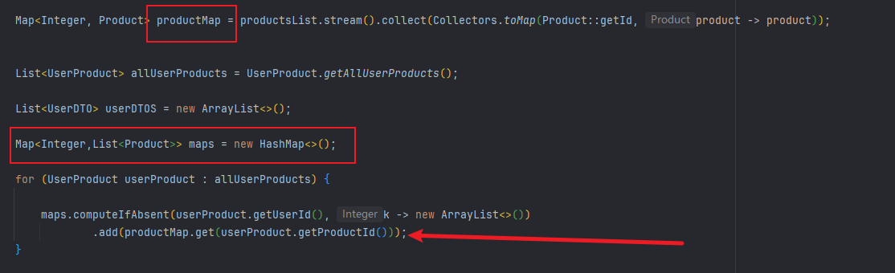
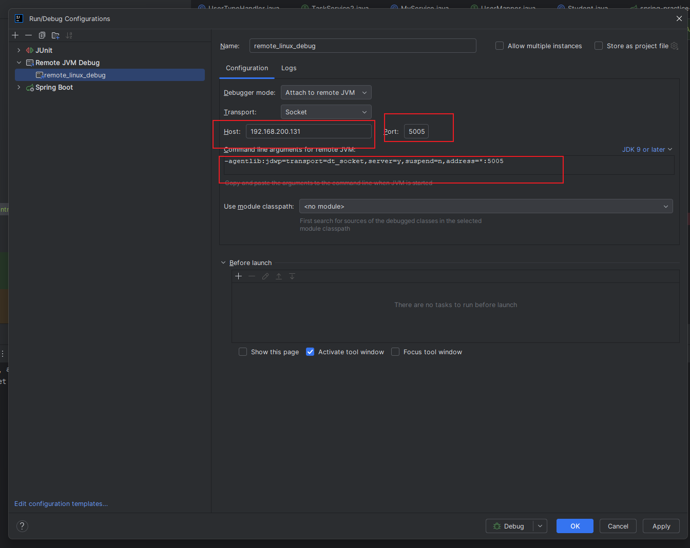
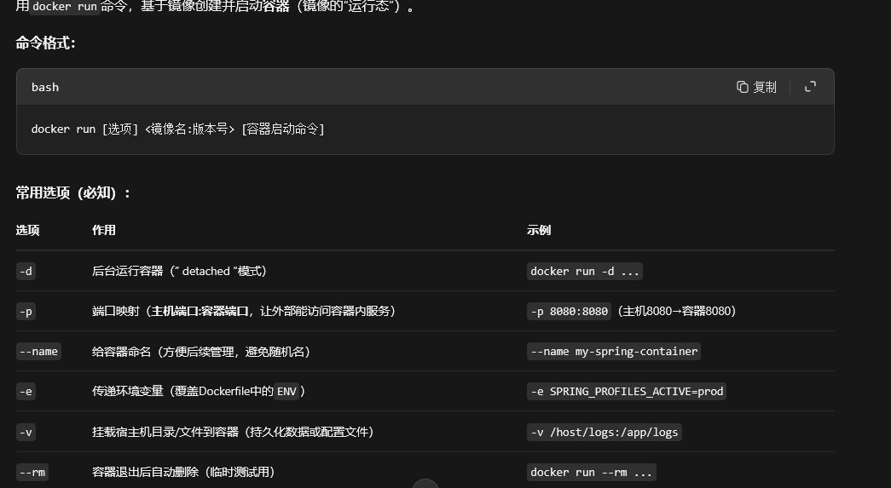
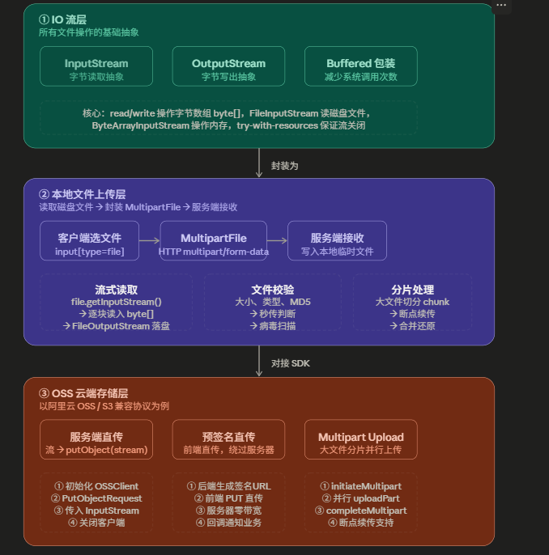
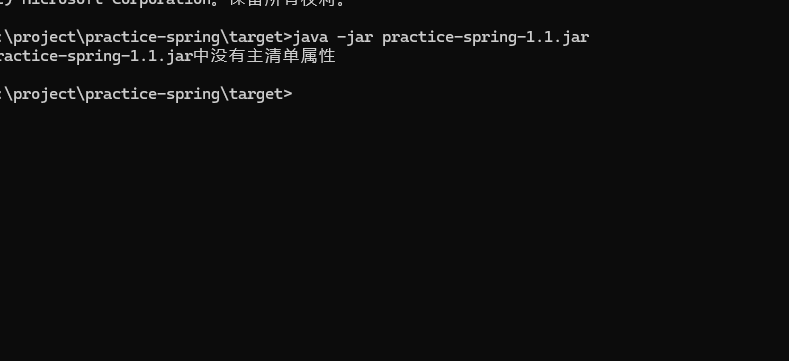
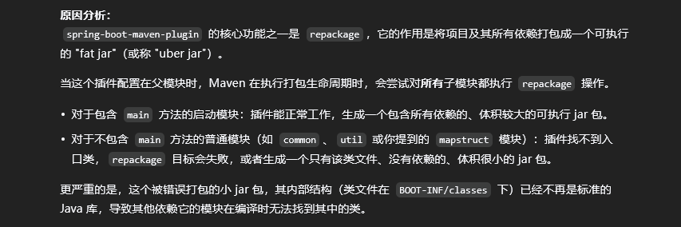
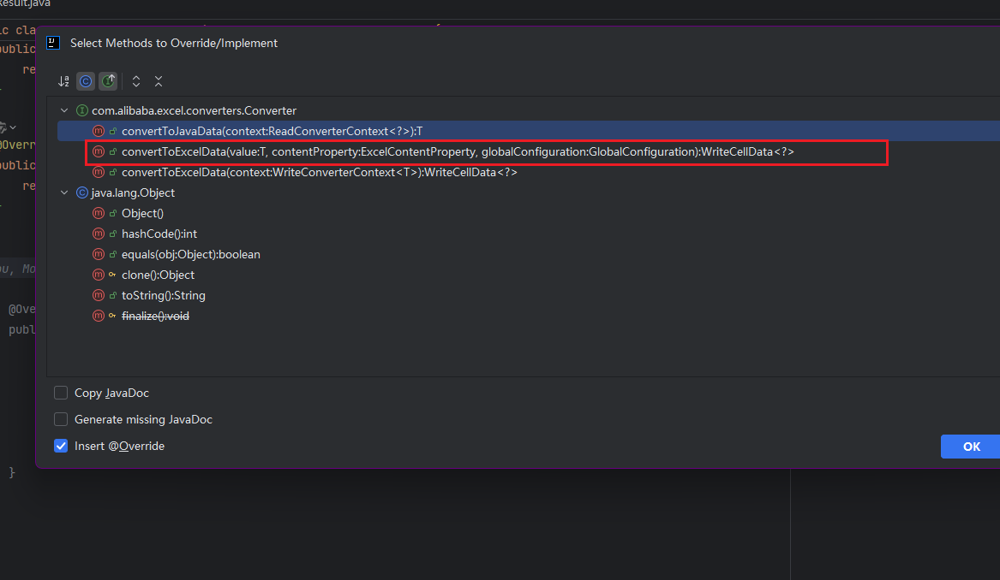
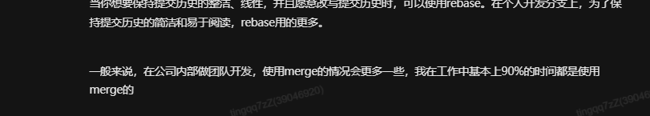

# 独孤九剑

# 数据库中1对多 多对多 嵌套关系的代码总结

* **一对一 (1:1)：** 比如“用户”和“身份证号”。（通常合并在一张表，或主外键关联）
* **一对多 (1:N)：** 比如“用户”和“订单”。（一个用户可以有多个订单，但一个订单只能属于一个用户。在“多”的一方记录用户 ID 即可）
* **多对多 (M:N)：** 比如你说的“订单”和“商品”。（必须引入第三张表）

#### 1 对 n

这种情况下有两种进行构造:

1. 通过sql xml 进行连表查询 通常n很小的情况下
2. 当n很大的情况下,推荐使用java代码进行组装.

1个文章中对应多个评论, 多个评论都属于同一个文章;

`Article`中包含 `id` ,`title` , `comment`

`Comment`表中 包含 `id` `article_id`, `content` ,`name`

返回的数据结构:

```json
[
  {
    "id": 1,
    "title": "Java动态代理详解",
    "comments": [
      { "id": 101, "userName": "张三", "content": "写得好！" },
      { "id": 102, "userName": "李四", "content": "学到了" }
    ]
  },
  {
    "id": 2,
    "title": "Spring AOP入门",
    "comments": [
      { "id": 201, "userName": "王五", "content": "期待后续" }
    ]
  }
]
```

代码写法:

```java
public class Article {

    private Long id;

    private String title;

    // 持有另外一个对象的引用
    private List<Comment> comments;
}


@Data
public class Comment {

    private Long articleId;

    private Long id;

    private String content;

    private String userName;

}


    /**
     * 获取文章列表
     * @return
     */
    public List<Article> getResult(){

      List<Article> articleList =    articleMapper.getAllArticalList();
      List<Comment> commentList =    commentMapper.getAllCommentList();

        //因为多个评论都是属于一个文章的,所以可以用文章id作为一个分组,当作一个map
    Map<Long,List<Comment>> commentMap  =  commentList.stream().collect(Collectors.groupingBy(Comment::getArticleId));

        //开始设置文章中的List集合
        for(Article article : articleList){

        List<Comment> commentsList =  commentMap.get(article.getId());

            if(commentsList !=null){
                article.setComments(commentsList);
            }
        }

        return articleList;
    }


```

还有一种方式: 就是使用Mybatis中的 <ResultMap>标签使用<collection> 标签来处理一对多的关系

在sql语句中写好Left join 来查询出来所有的对应关系,Mybatis 会自动处理

#### 多对多

**场景**：展示一个用户列表，每个用户下显示他购买的所有商品名称。

**数据库表设计 (简化版):**

* `users` 表: `id`, `name`
* `products` 表: `id`, `name`, `price`
* `user_product` (中间表): `user_id`, `product_id`

```json
[
  {
    "id": 1,
    "name": "Alice",
    "products": [
      { "id": 10, "name": "键盘", "price": 299.0 },
      { "id": 12, "name": "鼠标", "price": 99.0 }
    ]
  },
  {
    "id": 2,
    "name": "Bob",
    "products": [
      { "id": 11, "name": "显示器", "price": 1299.0 }
    ]
  }
]
```

```java
public class User{

	private Long id;
	private String name;

}

public class products{
	private Long id;
	private String name;
	private BigDecimal price;
}

public class UserProduct{
	private Long userId;
	private Long productId;
}


public class UseDTO{
	private Long id;
	private String name;
	private List<Product> products;
}


public List<UseDTO> getResult(){

	List<User> userList = userMapper.getAllUsers();
	List<Product> productList = productMapper.getAllProducts();

	List<UserProduct> relations = userProductMapper.getAll();

	Map<Long, Product> maps = productList.stream().collect(Collectors.toMap(Product::getId,v->v));


	List<UseDTO> finalResult = new ArrayList<>();

	for(User user : userList){

		UserDTO userDTO =   new UserDTO();
		userDTO.setId(user.getId());
		userDTO.setName(user.getName());
		
		List<Product> purchasedProducts = new ArrayList<>();
		
		for(UserProduct relation: relations){
			if(relation.getUserId().equals(user.getId())){

				Product  product =   maps.get(relation.getProductId()); 
				purchasedProducts.add(product);
			}

		     userDTO.setProducts(purchasedProducts);
		}


			finalResult.add(userDTO);

	}

	return finalResult;


}

```

对于复杂的关联表的sql编写的时候：

```xml
SELECT
ep.emp_id,
pr.project_name
FROM employee_project ep
JOIN project pr ON ep.project_id = pr.id
WHERE ep.emp_id IN
<foreach collection="empIds" item="id" open="(" close=")" separator=",">
  #{id}
</foreach>

一个职员id ，对应多个项目名称
如果想要难道查询结果： 

```

```java
Map<Long, List<String>> projectMap = empProjects.stream()
.collect(Collectors.groupingBy(EmployeeProjectDTO::getEmpId,
Collectors.mapping(EmployeeProjectDTO::getProjectName, Collectors.toList())));

先用empId 进行分组，然后通过 mapping进行映射：拿到项目名称，直接变成集合
```

#### 嵌套关系

* `orders` 表: `id`, `user_id`, `order_date`
* `users` 表: `id`, `name`, `address`
* `order_items` 表: `id`, `order_id`, `product_name`, `quantity`, `price`

```json
[
	{
		"id": 1001,
		"orderDate": "2023-10-27",
		"user": {
			"id": 1,
			"name": "Alice",
			"address": "北京"
		},
		"items": [
			{ "productName": "键盘", "quantity": 1, "price": 299.0 },
			{ "productName": "鼠标", "quantity": 2, "price": 99.0 }
		]
	}
]
```

```java
@Data
public class User {
    private String name;

    private Integer id;

    private String address;
}


@Data
public class Order {
    private Integer id;
    private Integer userId;
    private Date orderDate;
}

@Data
public class OrderItem {
    private Integer id;
    private String productName;
    private Integer quantity;
    private BigDecimal price;
    private Integer orderId;
}


public class OrderDTO {

    // orderId
    private Integer id;
    private User user;
    private Date orderDate;
    private List<OrderItem> orderItems;

}


    public List<OrderDTO> getAllOrderDTOs() {

        List<User> allUser = userMapper.getAllUser();
        Map<Integer, User> userMap = allUser.stream().collect(Collectors.toMap(User::getId, user -> user));
        List<OrderItem> orderItemsList = orderMapper.getOrderItems();
        Map<Integer, List<OrderItem>> itemList = orderItemsList.stream().collect(Collectors.groupingBy(OrderItem::getOrderId));
        List<Order> allOrders = orderMapper.getAllOrders();
        List<OrderDTO> orderDTOList = new ArrayList<>();
        for (Order order : allOrders) {
            User userInOrder = userMap.get(order.getUserId());

            List<OrderItem> orderItems1 = itemList.get(order.getId());

            OrderDTO orderDTO = new OrderDTO();
            orderDTO.setId(order.getId());
            orderDTO.setUser(userInOrder);
            orderDTO.setOrderDate(order.getOrderDate());
            orderDTO.setOrderItems(orderItems1);
            orderDTOList.add(orderDTO);
        }


        return orderDTOList;
    }

```

确定主对象到底是谁?

只要不是主对象，一律提前转成 Map

1:1 toMap

1:n groupingBy

n:n 使用关联关系表创建一个map



在第三方表中直接关联关系即可

#### 树形关系通用模板:

```java
Map<Long, Node> map = new HashMap<>();
List<Node> roots = new ArrayList<>();

//把所有的节点都放到里面
for (Node node : list) {
    map.put(node.getId(), node);
    node.setChildren(new ArrayList<>());
}

for (Node node : list) {
    if (node.getParentId() == null || node.getParentId() == 0) {
        roots.add(node);
    } else {
        Node parent = map.get(node.getParentId());
        if (parent != null) {
           parent.getChildren().add(node); 
        }
    }
}
return roots;
```

##

# 编程式事务操作API

```java

@Autowired
private PlatformTransactionManger transactionManager;


    public void testTransaction(){
    DefaultTransactionDefinition def = new DefaultTransactionDefinition();
    TransactionStatus transaction = transactionManager.getTransaction(def);

        try {
       //transaction operations


        // transaction commit
        transactionManager.commit(transaction);
        }catch (Exception e){

        //transaction rollback
        transactionManager.rollback(transaction);
            throw e;
        }
		


	}


使用: 编程式事务的TransactionTemplate
 public void performTransaction() {
        // 使用TransactionTemplate执行事务操作
     T result =    transactionTemplate.execute(status -> {
            try {
                // 执行事务操作
		        return T;     
            } catch (Exception e) {
                // 发生异常时，标记事务回滚
                status.setRollbackOnly();
                log.error("事务已经回滚");
                throw new RuntimeException("事务执行失败", e);
            }
        });
    }

出现异常可以不用setRollbackOnly();但是一定要抛出异常,否则程序会任务没有出现问题,事务会自动回滚;

```

# Map的相关api操作

* 如果get(Key) == null的话,使用putIfAbsent 就会生效 会修改map
* 如果getOrDefault(key) == null 的话, 自己在后面传入的默认值,不会生效!
* 使用computeIfAbsent的话,直接可以高效的计算 后续的value的问题;

| <code>**putIfAbsent**</code> | **是** | 原子性地“不存在则放入” | 旧值 | 一个**已创建好**的值 |
| --- | --- | --- | --- | --- |
| <code>**getOrDefault**</code> | **否** | 安全地“获取值或默认值” | 实际值或默认值 | 一个**默认值**，用于返回 |
| <code>**computeIfAbsent**</code> | **是** | 高效地“不存在则计算并放入” | 旧值或新值 | 一个**用于计算新值的函数** |

# 使用SimpleDateFormat 来个格式化时间

首先要有一个固定的格式化:

```java
private static final  String pattern = "yyyy-MM-dd HH:mm:ss";
```

SimpleDateFormat sdf  = new SimpleDateFormat(pattern);

set的时候注意转换就行了

比如: setDateTime(sdf.parse("2025-03-16 13:07:38"));

但要注意他是一个线程不安全的类

# Stream流的使用

Filter ：`filter`是**保留**满足条件的，不是删除满足条件的！

保留满足true的,过滤flase的数据

# 方法级别上校验:

也就是在验证用户是否权限足够:

使用`@EnableMethodSecurity`在启动类上

对于权限不足得我们要进行拦截:`AccessDeniedHandler`接口实现`handle`方法

要在配置类中添加

如下:

```java
http.exceptionHandling(exceptions -> exceptions.accessDeniedHandler(accDenyHDL)
                                                .authenticationEntryPoint(authEntryPoint));


http.authorizeHttpRequests(auth-> auth.requestMatchers("/path")
                           .permitAll()
                           .anyReqeust().authenticated())
```

# IDE全局修改变量名:

`shift + F6` 全局修改变量名称;

修改调用的方法名称: `ctrl + shift + R`

查看方法的调用链: `ctrl+ alt + H` 我本地电脑是: `ctrl+H`

# 游标分页的整体逻辑:

```java
        // start  1768379122032
        System.out.println("start" + System.currentTimeMillis());
        Long lastId = 1000L;
        int pageSize = 1000;

        while(true){
            List<Users> users = usersMapper.selectList(
                    new LambdaQueryWrapper<Users>()
                            .gt(Users::getId, lastId)
                            .orderByAsc(Users::getId)
                            .last("LIMIT " + pageSize));
            if (users.isEmpty())
                break;

            List<UserLog> userLogs = users.stream().map(user -> {
                UserLog userLog = new UserLog();
                BeanUtil.copyProperties(user, userLog);
                return userLog;
            }).toList();

            userLogMapper.insertList(userLogs);

            lastId =users.get(users.size() -1 ).getId();
        }
//        end 1768379123018
        System.out.println("end" + System.currentTimeMillis());


注意跳页的问题:
其实就是offset就是取最后结果的数据;
此时的话就要使用游标id分页;也就是在参数上带上id值就好了
怎么取id值,再查询的list集合中取最大值: eg: userList.get(user.size() - 1).getId()
最后拼上

// 核心是找到上一次批处理的id,拿到之后再把值赋值给 : lastId
// select * from users where id > lastId order by id asc limit 100;
```

# 工具类的使用:

```java
DateUtils.addMinutes(new Date(), 数字);

比如: 现在时2026/1/13 号 14:01 数字填的是: 30的话: 最后返回的时间是: 14:31
用来实现某些时间的输出;
使用:
 DateUtils.truncate(new Date(), Calendar.HOUR);
会返回当前时间: 整点 比如 现在时间是: 14:03 使用这个truncate()方法会返回: 14:00
```

# XXL-JOB 的分片任务工作原理?

两个参数:　shardTotal (也就是服务器的个数)

```
shardIndex(机器编号 从零开始)
```

工作原理:　拿着业务id 对 shardTotal进行取模 与 shardIndex进行比较;

如果相等 就将任务交给该机器进行处理,这样就能实现了数据隔离的情况

对于大数据量的操作: 就能够使用这种方式;

# RocketMQ的事务消息是同步的:

可以对调用栈进行分析;

# 分页信息的汇总:

```java


private List<T> datas;

//通常是抽象类
private Boolean success;

//
private int total;


private int pageSize;

private int currentPage;


```

在执行插入任务的时候:

做好幂等,防止重复创建两条

map 做: 转换的时候不好转换可以直接单独拎出来写

遇到复杂的需要转换的时候就需要for循环的break了

为了处理 Stream 难以处理的“提前中断（`break`）

# 使用TTL的场景

多线程上下文无法传递值;

使用TTL能够传递值

```java
 声明好 : TransmittableThreadLocal
 在多线程中使用就行了;
```

# 使用Redisson的坑

Redisson 的配置来源是：

* `redisson.yaml`
* 或 `Config` Java 配置
* 或你自己 `@Bean RedissonClient`

**它不会自动桥接 Spring Boot 的 RedisProperties**

这是一个**非常经典的“误以为共用配置”的坑**

**通过代码控制的,要不然一直连接不上**

```java
    @Bean
    public RedissonClient redisson(){
        Config config = new Config();
        config.useSingleServer().setAddress("redis://192.168.200.131:6379")
                .setPassword("NFTurbo666")
               .setDatabase(9);

         config.setThreads(16);
         config.setNettyThreads(32);

         return Redisson.create(config);
    
```

# 使用idea远程debug

java -agentlib:jdwp=transport=dt\_socket,server=y,suspend=n,address=\*:5005 -jar idea-remotedebug-1.0.jar

在idea中



# 编写dockerfile文件

```dockerfile
FROM eclipse-temurin:21-jre

## 创建目录，并使用它作为工作目录
RUN mkdir -p /yudao-module-erp-server
WORKDIR /yudao-module-erp-server
## 将后端项目的 Jar 文件，复制到镜像中
COPY ./target/yudao-module-erp-server.jar app.jar

## 设置 TZ 时区
## 设置 JAVA_OPTS 环境变量，可通过 docker run -e "JAVA_OPTS=" 进行覆盖
ENV TZ=Asia/Shanghai JAVA_OPTS="-Xms512m -Xmx512m"

## 暴露后端项目的 48088 端口
EXPOSE 48088

## 启动后端项目
CMD java ${JAVA_OPTS} -Djava.security.egd=file:/dev/./urandom -jar app.jar


# /dev/./urandom是Linux原生的非阻塞随机数设备文件，服务器默认自带；
# 参数作用是让Java用/dev/urandom代替/dev/random，避免容器/虚拟机中熵池不足导致的启动卡顿；
# 路径指向宿主机文件系统，与JDK/JRE无关。
```

有了dockerfile 比如在本环境目录下:

docker bulid -t my-spring-boot-app:1.0 .

-t：给镜像打标签（格式：镜像名:版本号，方便后续引用）；

* 构建过程会逐行执行Dockerfile指令（如`FROM`拉取基础镜像、`RUN`安装依赖、`COPY`复制代码）；
* 成功后会输出`Successfully built <镜像ID>`。

此后: 执行命令



# Mybatis日志排查问题:

开启springboot 使用mybatis场景:

```yaml
```

# 使用: python 导出到excel文件;

json美化一下:

```java
String prettyJson = JSON.toJSONString(parse, JSONWriter.Feature.PrettyFormat);
```

# 文件IO:

`InputStream`定义为: 字节输入抽象? (字节存在内存中

`OutputStream`定义为: 字节输出抽象? (

`FileInputStream` 读磁盘 → `FileOutputStream` 写磁盘

* **Input (输入)**：数据从外界（磁盘、网络）进入**内存**。
* **Output (输出)**：数据从**内存**写出到外界（磁盘、网络）。

**关键点**：所有的 IO 操作，本质上都是操作系统在内存和外部设备之间搬运数据的过程。



# Linux复制文件:

使用scp命令;

> scp secret.txt root@192.168.200.129:/root/package

# 遇到Could not find or load main class 错误之mavne编译失败:



究其原因: 缺失 spring-boot-maven-plugin 插件



在下面假如这一个配置,就能成功打包了

```xml
<plugin>
  <groupId>org.springframework.boot</groupId>
  <artifactId>spring-boot-maven-plugin</artifactId>
  <!-- 建议显式指定版本，通常与你引入的 Spring Boot 版本一致 -->
  <version>3.1.0</version>
  <configuration>
  </configuration>
  <executions>
    <execution>
      <goals>
        <goal>repackage</goal> <!-- 这是核心，用来生成 Fat Jar -->
      </goals>
    </execution>
  </executions>
</plugin>
```

spring-boot-maven-plugin的核心目标之一是repackage（默认绑定到Maven的package阶段）。它会做两件事：

先将项目编译成普通JAR（由maven-jar-plugin生成）；

再将该普通JAR重新打包为**Fat Jar**，内部结构遵循Spring Boot的规范e

# docker compose 常见镜像

```yaml
version: '3.8'

networks:
  app-network:
    driver: bridge

volumes:
  mysql_data:
  redis_data:
  nacos_data:

services:

  # MySQL 8 服务
  mysql:
    image: mysql:8.0 # 使用8.0系列的最新稳定版
    container_name: mysql8
    restart: unless-stopped
    networks:
      - app-network
    volumes:
      # 数据持久化到命名卷
      - mysql_data:/var/lib/mysql
      # (可选) 挂载自定义配置文件
      - ./conf/mysql/my.cnf:/etc/mysql/conf.d/custom.cnf
    environment:
      MYSQL_ROOT_PASSWORD: your_strong_root_password # 请务必修改此初始root密码
      MYSQL_DATABASE: example_db                 # (可选) 初始化时创建的数据库名
      MYSQL_USER: example_user                   # (可选) 初始化时创建的用户
      MYSQL_PASSWORD: example_password           # (可选) 上述用户的密码
    ports:
      - "3306:3306" # 将容器3306端口映射到主机3306端口
    command: [
        '--default-authentication-plugin=caching_sha2_password', # 推荐的身份验证插件
        '--character-set-server=utf8mb4',
        '--collation-server=utf8mb4_unicode_ci'
      ]

  # Redis 7 服务
  redis:
    image: redis:7-alpine # 使用7系列的alpine轻量版镜像
    container_name: redis7
    restart: unless-stopped
    networks:
      - app-network
    volumes:
      # 数据持久化到命名卷
      - redis_data:/data
    ports:
      - "6379:6379"
    command: redis-server --appendonly yes # 开启AOF持久化

  # Nacos 服务
  nacos:
    image: nacos/nacos-server:v2.4.3 # 使用v2.x稳定版，替换为最新稳定版号
    container_name: nacos-standalone
    restart: unless-stopped
    networks:
      - app-network
    volumes:
      - nacos_data:/home/nacos/data
      # (可选) 挂载自定义日志目录
      - ./logs:/home/nacos/logs
    environment:
      MODE: standalone # 单机模式
      SPRING_DATASOURCE_PLATFORM: mysql # 指定数据源为mysql
      MYSQL_SERVICE_HOST: mysql # 连接到本compose文件中的mysql服务
      MYSQL_SERVICE_DB_NAME: nacos_config # nacos使用的数据库名
      MYSQL_SERVICE_PORT: 3306
      MYSQL_SERVICE_USER: root # 连接mysql的用户名
      MYSQL_SERVICE_PASSWORD: your_strong_root_password # 连接mysql的密码，需要与上方mysql设置的密码一致
      NACOS_SERVER_IP: localhost # (生产环境应改为实际服务器IP)
    ports:
      - "8848:8848"
      - "9848:9848"
      - "9889:9889"

  # Nginx 服务
  nginx:
    image: nginx:stable-alpine # 使用稳定版的alpine轻量版镜像
    container_name: nginx-stable
    restart: unless-stopped
    networks:
      - app-network
    volumes:
      # (推荐) 挂载自定义配置文件
      - ./conf/nginx/nginx.conf:/etc/nginx/nginx.conf
      # (推荐) 挂载站点目录
      - ./html:/usr/share/nginx/html
      # (推荐) 挂载日志目录
      - ./logs/nginx:/var/log/nginx
    ports:
      - "80:80"
      - "443:443"
    depends_on:
      - mysql
      - redis
      - nacos
```

执行的话: 在dockercompose.yml目录下执行:

```shell
docker-compose up -d
```

```shell
docker-compose down
```

# 在同时引入Springboot-mybatis-starter 和 springboot-mybatis-plus-starter后

同时引入了两个 starter，但最终起作用的是 MyBatis-Plus 的自动配置，因为：

* **MyBatis-Plus 会创建自己的 SqlSessionFactory**
* MyBatis-Plus 的配置会覆盖原生 MyBatis 的配置
* MyBatis-Plus 的 Mapper 扫描器会接管所有的 Mapper

因此，即使您配置了 `mybatis.mapper-locations`，实际上生效的却是 `mybatis-plus.mapper-locations`。

**建议：** 在同时使用两个框架时，统一使用 `mybatis-plus.*` 的配置方式，因为 MyBatis-Plus 兼容大部分 MyBatis 的配置项，并且提供了更多增强功能。

像后续的日志开启,mapper文件生效位置;都直接写在mybatis-plus下面;

# 全局日期格式转换

此场景只会解决在web场景中问题;

为了解决: 数据库中使用datetime , java类中的实体使用LocalDateTime

1. 配置信息:

```yaml
spring: 
  jackson:
    date-format: yyyy-MM-dd HH:mm:ss
    time-zone: GMT+8
    serialization:
      write-dates-as-timestamps: false

```

2. 使用配置类

```java
@Bean
@Primary
public Jackson2ObjectMapperBuilder jackson2ObjectMapperBuilder(){
    return new Jackson2ObjectMapperBuilder()
    .dateFormat(new SimpleDateFormat("yyyy-MM-dd HH:mm:ss"))
    .timeZone(TimeZone.getTimeZone("GMT+8"))
    .featuresToDisable(SerializationFeature.WRITE_DATES_AS_TIMESTAMPS)
    .modules(new JavaTimeModule());
}


这个配置只在以下场景生效：

    REST API 返回 JSON 时（@ResponseBody）
    接收 JSON 请求参数时（@RequestBody）
    RestTemplate、WebClient 等 HTTP 客户端的序列化
```

两者2选1

# 使用定时任务的几种方式:

**最明显区别**: 当任务执行时间较长时，`scheduleAtFixedRate` 可能会在上次任务还没完成时就启动新任务，而 `scheduleWithFixedDelay` 会等待上次任务完成后再延迟执行。

使用 ScheduledExecutorService executor = Executors.newScheduledThreadPool(2);

使用: executor.scheduleAtFixedRate / executor.scheduleWithFixedDelay

使用spring中的@Schedule 注解 注意要在配置类上面加入：@EnableScheduling

使用cron表达式;

```plain
秒 分 时 日 月 周 年（可选）
* * * * * ? *	
```

使用XXLjob

# 文件POI和EasyExcel的基本写入?

使用POI语法:

1. 创建excel文件: 目前只用(XSSFWorkbook) 以及流式处理的文件

其中excel 中表sheet 有行  row 表格(列)

```java
private static void crateXSSFWorkbook() throws IOException {
//Excel = 树结构（Workbook → Sheet → Row → Cell）
// 只用:
//XSSFWorkbook
Workbook workbook = new XSSFWorkbook();
//表
Sheet sheet = workbook.createSheet("sheet1");
// 第一行
Row row = sheet.createRow(0);
//第一个的第一格 也就是第一列吧
Cell cell = row.createCell(0);
Cell cell2 = row.createCell(2);
cell2.setCellValue(123);
//内容
cell.setCellValue("Hello POI");
//第二行
Row row1 = sheet.createRow(1);
//第二行的第一格
Cell cell1 = row1.createCell(0);
cell1.setCellValue(true);
// Write the output to a file
try (OutputStream fileOut = new FileOutputStream("workbook.xlsx")) {
    workbook.write(fileOut);
}
}
```

2. 读取excel

```java
    private static void readValueAccPOI() throws IOException {
        FileInputStream file = new FileInputStream("workbook.xlsx");
        Workbook wb = WorkbookFactory.create(file);
        Sheet sheet = wb.getSheetAt(0);

        for (Row row : sheet) {
            for (Cell cell : row) {
                System.out.print(cell.toString() + " ");
            }
            System.out.println();
        }
    }
```

有溢出问题主要是因为: 全部的数据100w行 \* 20列都加载到内存中; 导致内存OOM

使用EasyExcel去读和写文件;

1. 要有实体;

```java
    public UserExcel() {
    }

    public UserExcel( String name,Integer age) {
        this.age = age;
        this.name = name;
    }

    @ExcelProperty("姓名")
    private String name;

    @ExcelProperty("年龄")
    private Integer age;

    public String getName() {
        return name;
    }

    public void setName(String name) {
        this.name = name;
    }

    public Integer getAge() {
        return age;
    }

    public void setAge(Integer age) {
        this.age = age;
    }

    @Override
    public String toString() {
        return "UserExcel{" +
                "name='" + name + '\'' +
                ", age=" + age +
                '}';
    }
```

2. 要有监听器:

```java
继承: AnalysisEventListener<T> 
重写invoke方法
其中这个就是读取的数据的逻辑
```

3. 使用easyexcel的api方法;

```java
EasyExcel.read(FileInputStream,T,new xxxListener()).sheet().doRead();
.sheet()默认只读一个sheet 也就是等价于: .sheet(0)
如果多个sheet 则需要:.doReadAll();
```

写的话更简单了:

```java
EasyExcel.write("生成的文件名",T).sheet("sheetName").doWrite("writeToFileList");
```

```java
EasyExcel.write(fileOutPutStream,T).sheet("").doWrite("wirteToFileList");
```

导出多sheet 页的方法:

```java
        response.setContentType("application/vnd.openxmlformats-officedocument.spreadsheetml.sheet");
        response.setCharacterEncoding("UTF-8");
        String fileName = URLEncoder.encode("用户列表", StandardCharsets.UTF_8);
        response.setHeader("Content-Disposition", "attachment;filename=" + fileName + ".xlsx");

        // 2. 模拟数据（实际从数据库查）
        List<User> list = new ArrayList<>();
        list.add(new User("张三", 18));
        list.add(new User("李四", 20));
        list.add(new User("王五", 25));
        //第二种场景
//        EasyExcel.write(response.getOutputStream(),User.class).sheet("userList").doWrite(list);
        List<Order> orderList = new ArrayList<>();
        orderList.add(new Order("order01","001", LocalDateTime.now(), OrderStatus.PENDING_PAYMENT,LocalDateTime.now()));
        orderList.add(new Order("order02","002", LocalDateTime.now(), OrderStatus.PAID,LocalDateTime.now()));
        orderList.add(new Order("order04","004", LocalDateTime.now(), OrderStatus.CANCELLED,LocalDateTime.now()));
        orderList.add(new Order("order05","005", LocalDateTime.now(), OrderStatus.COMPLETED,LocalDateTime.now()));
        orderList.add(new Order("order06","009", LocalDateTime.now(), OrderStatus.DELIVERED,LocalDateTime.now()));
        orderList.add(new Order("order07","007", LocalDateTime.now(), OrderStatus.PENDING_PAYMENT,LocalDateTime.now()));


        ExcelWriter excelWriter = EasyExcel.write(response.getOutputStream()).build();

            WriteSheet sheet01 = EasyExcel.writerSheet("用户列表").head(User.class).build();
            excelWriter.write(list, sheet01);

            WriteSheet sheet02 = EasyExcel.writerSheet("订单列表").head(Order.class).build();
            excelWriter.write(orderList, sheet02);

            excelWriter.finish();
    }e
```

## 多sheet页导出坑点1:

如果映射实体中存在枚举,需要自定义映射类 实现easyexcel中的: `Converter`



```java
@Override
    public WriteCellData<?> convertToExcelData(OrderStatus value, ExcelContentProperty contentProperty, GlobalConfiguration globalConfiguration) {
        if (value == null) {
            return new WriteCellData<>("");
        }
        return new WriteCellData<>(value.getDesc());
    }
```

<font style="color:#DF2A3F;">重写这个方法的取值逻辑; 因为他不知道你枚举中到底取得code 还是desc;</font>

写完之后在实体上标注:

```java

@ExcelProperty(value = "订单状态",converter = OrderStatusConverter.class)
private OrderStatus status;
```

## 坑点2:

一定要这样写,因为这样写会自动调用 `excelWriter.finish()`方法,如果不这样写,文件内容就是为空;

```java
// ✅ 正确写法
try (ExcelWriter excelWriter = EasyExcel.write(response.getOutputStream()).build()) {

    WriteSheet sheet01 =
    EasyExcel.writerSheet("用户列表")
    .head(User.class)
    .build();
    excelWriter.write(list, sheet01);

    WriteSheet sheet02 =
    EasyExcel.writerSheet("订单列表")
    .head(Order.class)
    .build();
    excelWriter.write(orderList, sheet02);
}
```

# merge > rebase



# 最低反射原则尽量少使用反射

遇到属性拷贝的,我们统一 选择mapstruct 框架

简单场景我们使用 stream+ map的方式


> 更新: 2026-04-14 14:04:13  
> 原文: <https://www.yuque.com/alice-hv75k/mtczog/oxtpuouu8ibwfiui>