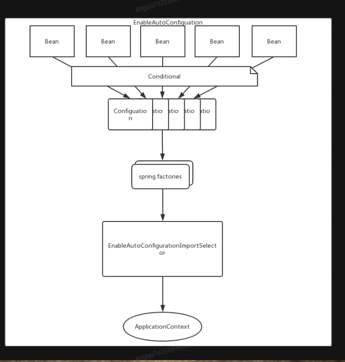
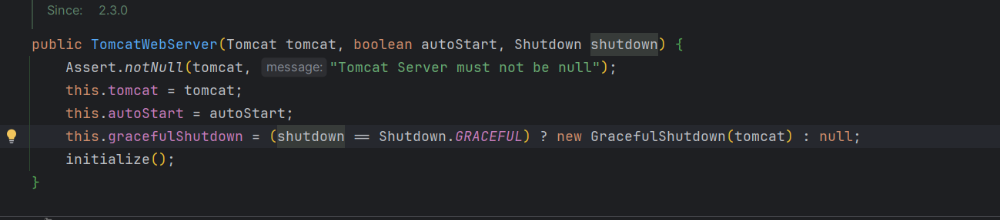
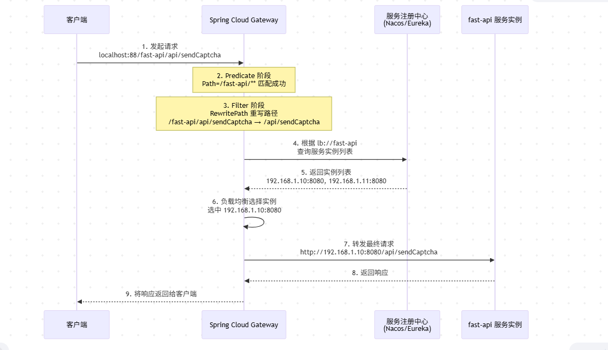
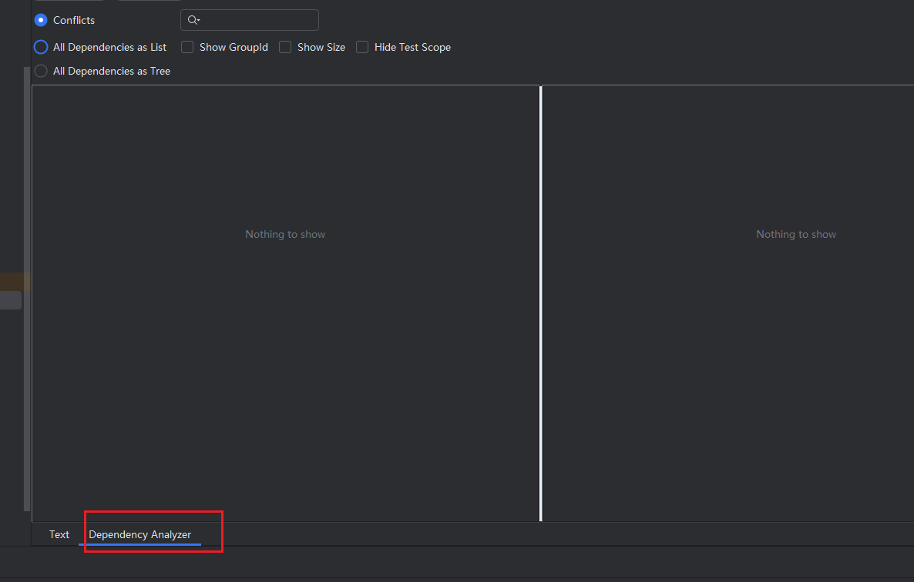

# 葵花宝典

# Java

#### 接口和抽象类的区别?

在职责上: 接口是制定规范,抽象类是为了复用(模板方法)

使用方式上: 实现了接口或者继承了抽象类(抽象方法)就要重写他们的方法,接口多实现,抽象类单继承.

形式: 接口使用interface 不能有修饰符,默认public

抽象类则是 abstract 关键字,可以使用public private 等修饰符

<font style="color:#ED740C;">使用场景</font>:

一般在实际开发中,先把接口暴露给外部,然后在业务代码中实现接口,如果多个实现类中有相同可以复用的代码,在接口和实现类中加一层抽象类,将公用部分代码抽出到抽象类中.

#### String StringBuilder StringBuffer 的区别?

String is immutable

其他两者可变 StringBuilder 效率高线程不安全, StringBuffer 效率稍低使用Synchronized

#### 有了基本类型为什么还需要包装类?

接口中定义的返回类型使用包装类;

包装类的缓存: Integer\[-128,127]

不是所有的数据:都能在计算机中使用浮点数来表示,(不是所有的数据都能被二进制表示) float表示单精度浮点数,double表示双精度浮点数,表示的都是近似值

所以不能使用float或者doule进行高精度运算. 使用BigDecimal进行精确计算

#### 使用BigDecimal的要点

可以new BigDecimal 传入的参数是String类型

也可以使用BigDecimal.valueOf(long/double type)

比较两种类型值相同的话要使用BigDecimal.compareTo()

#### 语法糖有哪些?

比如switch中支持String 支持泛型 增强For循环 断言

#### 什么是深拷贝 什么是浅拷贝?

浅拷贝是指将一个对象复制到另外一个变量中,但只复制对象的地址,而不是对象本身,也就是说,原始对象和复制对象实际上共享同一个内存地址;

深拷贝:将一个对象及其所有子对象都复制到另外一个变量中,会创建出一个全新的对象,

原始对象中的所有属性和元素都复制到新的对象中

#### 动态代理如何实现?

实现`InvocationHandler`接口也就是在代理类中持有真实业务逻辑对象的引用,

在invoke(target,args);其中target就是真实的业务对象; args:就是调用真实业务方法传递的参数; 在方法执行前或者执行后,增加业务逻辑; 比如说耗时操作?

真正让代理类实现作用的时候: 就是通过`Proxy`类(Proxy.newInstance)创建持有真实对象的类加载器,类的接口,和处理器handler;然后就调用相关的方法喽

#### map中 put的基本逻辑?

首先 object中的equals方法指的是两者对象引用地址是否相同,如果我们在业务中冲洗了equals方法,就代表着比较的对象的属性值是否相同,如果相同,我们认为是业务逻辑上相同,但并不代表他们是同一对象,至于为什么也要重写hashCode方法,是因为: 保证相同的equals情况下,hashcode码也必须相同,这时候,如果不同,存放位置的桶就不一致,hashcode不一致 程序就根本不会比较equals,因为hashcode不同,就判定为不同的对象啊,所以equals根本没有比较的机会,只有在hashcode相同的情况下,得到存储元素下标的时候去判断,当前位置是否有元素,没有,万事大吉,有 -> equals登场,相同直接覆盖?如果不同呢将元素插入到链表后面,如果链表长度过长 转化成红黑树,

这时候你想问查询该怎么走? 就是遇到了hash冲突之后:其实这样走的:

先根据hash定位到链表,然后再拿着后面链表的值进行遍历;

get的时候找到当前key 相等的entry,这样就能返回value值了,如果找不到相等的key,就直接返回null

#### ArrayList的序列化?

重写了`readObject` `writeObject`只序列化存储的元素,对于那些空的值(初始容量)不进行序列化

#### 为什么有了equals方法还要重写hashcode()方法?

```java
// 当执行 map.get(person) 时，HashMap 内部的查找流程：
public V get(Object key) {
    Node<K,V> e;
    // 步骤1：计算哈希值
    int h = hash(key.hashCode());  // 如果 hashCode 实现有问题，这里就出错了
    
    // 步骤2：定位到数组位置
    int index = h & (table.length - 1);
    
    // 步骤3：在对应位置查找
    if ((e = table[index]) != null) {
        // 关键：先比较哈希值，再比较 equals
        if (e.hash == h && (key == e.key || key.equals(e.key))) {
            return e.value; // 找到了
        }
    }
    return null; // 没找到
}
```

确实就是为了防止哈希结构（HashMap、HashSet 等）在使用时出现问题。如果只重写 `equals()` 不重写 `hashCode()`，就会导致：

* 相等的对象无法正确存储和检索
* 集合行为不符合预期
* 缓存系统失效
* 性能问题

# MySQL

#### 如何理解幻读,不可重复读,脏读?

脏读就是: 并发事务中一个事务读取到了另外一个事务没有提交的数据,发生在(<font style="color:rgb(68, 68, 68);">Read Uncommitted</font>)

不可重复读: 一个事务内读取到了另外一个事务最新提交的数据,导致一条数据的结果不太一样,

发生在(<font style="color:rgb(68, 68, 68);">Read Committed</font>)

幻读: 一个事务在做范围查询的时候: 前后两次查询到的结果条数变了(INSERT/DELETE)

发生在(<font style="color:rgb(68, 68, 68);">Repeatable Read</font>)这种场景下

但其实大部分的幻读在RR隔离级别下其实能够预防大部分的幻读原因是使用了NEXT\_KEY\_\_LOCK

其实Next\_key\_lock = 行锁 + 间隙锁(全闭区间) -> 左开右闭

对于不走索引的表结构扫描,MySQL不是把全表给锁了,这个时候另外一个事务就可以执行事务提交操作,从而导致幻读.

> **MySQL的RR隔离级别通过Next-Key Lock机制，在所有走索引的查询中，都能有效防止幻读。但对于不走索引的全表扫描查询，存在一个已知的、为了性能而妥协的例外情况**

#### 事务的隔离级别有哪些?

读未提交 : Read Uncommited

读已提交: Read Committed

可重复读: Repeatable Read

串行化: Serializable

#### 要记住默认的隔离级别?

MySQL的默认隔离级别是: RR(一个事务内看到的数据记录始终一致)

binlog 格式:　Statement (发生主从复制的时候记录的是SQL原文)

为了避免在RR隔离级别下面数据不一致的场景: 使用next key lock

#### 锁的级别?

在RR中

Record Lock 表示记录锁, 锁的是索引记录

Gap Lock 是间隙锁 ,锁的是索引记录之间间隙

Next key lock = Record Lock + Gap lock

在RC中

只会对索引增加Record Lock 锁

#### 当sql中判断条件有主键/唯一索引时?

会自动优化将Next-key\_Lock(Gap Lock + Record Lock) 退化成Record Lock

**你锁住的就是那一行**

***

#### 不同的隔离级别下RC 和 RR

RC insert 操作 隔离级别下不会变成GAP LOCK 会变成 : 行级锁 也就是只锁这一行;

#### update的底层视角?

* 从内存中获取数据,InnoDB中的Buffer Pool  也就是在这个里面中拿到数据
* 进行更新的时候,加行锁(针对有索引记录的条件),确保本次修改不受其他影响
* 记录undo log日志,记录原本的值,这也就是其他事务能看到没有被修改的数据原因
* 修改buffer pool中的数据: 真的进行了修改是一个物理级别的更新
* 记录redo log 日志,至于要不要刷入磁盘,要看配置,
* 将redo log 日志变成prepare状态,写入binlog 日志,然后redo log 写入commit状态
* 提交事务,释放锁

#### 在必须使用Join的场景下 如何做好优化?

小表驱动大表,小表是外层循环,大表是内层循环;

#### mysql update的时候什么时候锁表什么时候锁行?

InnoDB：优先行锁（但可能升级为“锁范围”或接近锁表）\
MyISAM：只有表锁\
是否锁表 ≈ 是否能用索引精确定位 + 扫描范围大小

#### mysql 的联合索引生效范围?

```plain

-- b 用了范围，c 无法走索引过滤
WHERE a=1 AND b>2 AND c=3
MySQL 走完 `a=1, b>2` 之后，剩余的 c 需要在 b 的结果集里逐行判断，**不再走索引**。

---

查二级索引 → 拿到主键 → 回主键索引查完整行
```

# JUC

#### 什么是上下文切换?

指的是CPU从一个线程转到另外一个线程,需要保存当前线程中的上下文状态,恢复另外一个线程的上下文状态,以便下一次恢复执行该线程时能够正确的运行

#### 发生上下文切换的场景?

`Thread.sleep()` 线程主动让出CPU

`Lock.lock()`线程被阻塞

#### 线程安全的理解?

指的是某一个函数在并发环境中被调用,能够正确地处理多个线程之间的共享变量,使程序功能正确完成. \[并发/多线程/共享变量/正确完成] 也就是满足原子性 有序性 可见性

#### 类变量 成员变量 局部变量区别? 是否存在线程安全问题呢?

类变量存放在JVM方法区(元空间)

成员变量存放在 堆内存中

局部变量存放在 栈内存中

类变量和成员变量 是共享变量

局部变量不存在线程安全的问题;

#### 线程中有哪几种状态?怎么流转的??

New

Runnable

Waiting

Timed-waiting

Blocked

Terminated

# Redis

#### redis支持哪几种数据类型?

string

可以最大存储512MB大小的数据

hash

类似与Java中的: Map\<String,Map\<String,String>> 这种类型的

key: 都是String  value就是:

list :

set:  无序且唯一的字符串元素集合

sorted set :  和Set一样，元素也是唯一的，但每个元素都会关联一个 `double` 类型的分数

#### redis中的zSet怎么实现的?

#### Redisson.getBucket(String keyName) 做了什么?

getBucket(String name)：是一个本地操作，仅根据名称生成一个 RBucket句柄对象。不检查、不创建 Redis 中的 Key。

Key 的存在性检查与创建：只发生在后续调用 RBucket的方法时，例如：

.get()：检查存在性并返回值（不存在则返回 null）。

.set()：强制创建或覆盖 Key。

.setIfAbsent()：检查不存在后才创建。

.isExists()：显式检查 Key 是否存在。

<code>**getBucket()**</code>**根本不参与创建 Key 的决策，它只是一个准备工具。**

***

# Spring

#### spring的生命周期是什么?

#### spring初始化流程有哪些步骤呢?

#### postConstruct afterPropertiesSet() initMethod 执行顺序是什么?

先说 afterPropertiesSet() 和 initMethod()

在`initializeBean()`中的`invokeInitMethods(beanName, wrappedBean, mbd)`能看到:

afterPropertiesSet() > initMethod()

都是在`initializeBean()`前的`applyBeanPostProcessorsBeforeInitialization()`中的`BeanPostProcessor.postProcessBeforeInitialization()` 中的实现类:

`InitDestroyAnnotationBeanPostProcessor`中的: `postProcessBeforeInitialization()`中的: `findLifecycleMetadata()`方法中的`CommonAnnotationBeanPostProcessor`的@postConstruct

则是体现在: `()`

所以:  @postConstruct> afterPropertiesSet() > initMethod

#### AOP的具体原理呢?

AOP 首先要用的话再要启动类上加上注解:　`EnableAspectJAutoProxy`

在自己写的切面上: `@Aspect` 并且要标注该切面为Bean对象

pointCut -> 定义切点

jointPoint　 -> 程序运行的执行点 一版都是:`proceedingJointPoint`

advice ->通常是通知 (before after around after returning after throwing / finally)

从整个生命周期来看:  AOP发挥作用的是在: BeanPostProcessor.postProcessAfterInitialization()中的

```java
@Nullable
public Object postProcessAfterInitialization(@Nullable Object bean, String beanName) {
if (bean != null) {
    Object cacheKey = this.getCacheKey(bean.getClass(), beanName);
    if (this.earlyBeanReferences.remove(cacheKey) != bean) {
        return this.wrapIfNecessary(bean, beanName, cacheKey);
    }
}

return bean;
}
```

需要注意的是如果DI(Dependency Inject) values 不在pointCut 范围之内, DI的对象还是原本的对象,而不是代理对象

# SpringBoot

#### Springboot是如何实现自动装配得?

@EnnableAutoConfiguraion注解下面得Import注解得AutoConfigurationImportSelector,下面得

getAutoConfigurationEntry 就是返回自动装配的配置，其中自动装配中的类加载@Configuration的类型，又是通过：@ConditionOnMissBean 等注解



#### SpringBoot 中Tomcat 启动方式？



#### Spring AOP失效的场景有哪些?

内部类方法调用

使用static方法

final方法调用

私有方法调用

#### 在Spring中如何实现多环境配置?

使用`@Profile`注解

或者在配置文件中: `spring.profiles.active` = ?

或者通过JVM参数启动: `-Dspring.profiles.active=prod`

#### Spring中的事务在多线程中失效的问题:

如果使用: `@Transactional` spring中的事务会失效,因为声明式事务底层使用的是ThreadLocal, ThreadLocal是线程隔离的,每一个线程都有自己的事务上下文线程, 新线程的事务不会包含在原来已有线程事务中.

怎么解决?

使用编程式事务: [独孤九剑](https://www.yuque.com/alice-hv75k/mtczog/oxtpuouu8ibwfiui)中编程式事务使用;

#### springsecurity的作用方式?

Filter 决定：

└── 构造哪种 Authentication

AuthenticationManager 决定：

└── 用哪个 Provider

Provider 决定：

└── 是否认证成功

```java
public interface Authentication extends Principal, Serializable {

    Object getPrincipal();      // 你是谁（未认证时可能只是 username）
    Object getCredentials();    // 你凭什么（password / token）
    Collection<? extends GrantedAuthority> getAuthorities(); // 你能干啥
    boolean isAuthenticated();  // 是否已认证
}

```

#### 使用哪种方式注册servlet 的bean呢?

使用FilterRegistrationBean这个类型可以精确的控制要增加的过滤器的顺序/路径

urlPatterns、order、dispatcherTypes、asyncSupported

order值越小,优先级越高!

#### 编程式事务和声明式的基本使用方式?

编程式使用: `PlatformTransactionManager` `TransactionDefinition``TransactionTemplate`

其实编程式事务使用方式比较精细, 在执行业务逻辑的时候判断逻辑是否出现: 异常,如果出现异常,需要在程序中设置: `status.setRollbackOnly()` 然后在try catch外层提交:

`transactionManger.commit(status)`

TransactionTemplate 不会这么复杂　代码也很好看：

**注意的是:返回值不要忘记了**

```java
@Autowired
private TransactionTemplate transactionTemplate;
public void testTransactionTemplate(){
    transactionTemplate.execute(status -> {
        //事务逻辑操作:
        boolean error = false;
        //
        if (!error){
            status.setRollbackOnly();
        }
        return null;
    });
}
```

#### SpringMVC是如何将不同的Reqeust路由到不同的controller中的?

* \[x] 晚上需要做的结合GPT来完成相关;
* \[x] 比较复杂其实是一个大的map key:各种条件 value:HandlerMethod

#### 日志框架和日志门面有何不同呢?

日志框架是真正干活的;把日志写在控制台,文件,或者数据库

logback/log4j2

日志门面:只是提供一些空的接口; **只定义规则 它定义了 **<code>**info()**</code>**、**<code>**debug()**</code>**、**<code>**error()**</code>**这些方法长什么样。**

SLF4J

Apache Common Logging

`springboot-starter` 自带 slf4j和logback 无需单独引入,如果想要特定格式的文件输出,需要自定义日志文件配置比如`logback-spring.xml`

# Mybatis

#### 动态SQL的使用

```xml
<if test = "username !=null">
  name = #{username}
</if> 


<foreach collection = "idList" item = "id" speartor = ",">
    (#{id})
</foreach>
<!--

  要么在foreach中加入 open = "(" close = ")"  
  要么就在这个下面赋值语句中加入: ()
 不能这两个都要加对吧


-->

<set>
  
</set>


```

#### 在使用Mp做limit查询的时候注意:

```java
userMapper.selectList(new LambdaQuaryWrapper<User>()).eq(User::getId,id).
last("LIMIT " + pageSize);


//这个地方的limit 后面要加空格
```

# MQ

# SpringCloud

#### 微服务中有哪些调用方式？

HTTP协议调用方式

Feign

使用Spring 6.0 @HttpExchange 客户端 替代Feign

rpc: Dubbo

消息队列

#### 灰度发布什么的？

#### 限流/降级/熔断有什么区别?

限流是: 避免我自己的服务或者下游的服务被打垮

降级: 系统负载过高,主动关闭一些非核心功能

熔断: 防止系统因为某一个服务故障整体崩溃,检测到下游服务异常的时候,自动停止该服务发送请求.

#### 在springcloud gateway中如果遇到路径需要重写?

> <https://docs.spring.io/spring-cloud-gateway/reference/spring-cloud-gateway-server-webmvc/filters/rewritepath.html>

请求方式: predicate -> filter -> uri

```yaml
spring:
  application:
    name: gateway-service
  cloud:
    gateway:
      routes:
        # 验证码服务路由
        - id: captcha-service-route
          uri: lb://fast-api  # 从注册中心根据服务名 fast-api 查找实例
          predicates:
            # 1. 匹配所有以 /fast-api/ 开头的请求
            - Path=/fast-api/**
          filters:
            # 2. 使用 RewritePath 过滤器重写路径，去掉 /fast-api/ 前缀
            - RewritePath=/fast-api/(?<segment>.*), /${segment}
```



# English

much more + adj  -> 代表某种状态 很.....

EG:

With the development of our modern society, people's living conditions become much more comfortable

| Time |   | |
| --- | --- | --- |
| Dec.19 | immutable | 不可变的 |
| | immediate | 立即的, 即时性 |
| | serializable | |
| Dec.20 | | |
|  | replace | 替代 |
|  | | |
| Dec.22 | | |
|  | terminated | 终止 |
| Dec.23 | | |
|  | captcha | 验证码 |
|  | infrastructure | 基础建设 |
| Jan. 4 | | |
|  | authentication | 认证 |
|  | passionnate | 热情得,十分渴望的 |
|  | | |
| Jan.9 | | |
|  | fanatic | FNC 狂热者 |
|  | | |
|  | | |
|  | | |

3.3

justice is served 正义终将得到伸张!

had any luck doing sth  做某事有没有进展/有没有成功

eg:  Have you had any luck deploying the new version?

Have you had any luck resloving the bug?

```
   I haven’t had any luck contacting the supplier.  

   I had no luck debugging the concurrency issue.  
```

# 线上环境遇到的问题:

#### 端口被占用:

```shell
lsof -i: port
netstat -tulnp |grep port

```

#### 线上服务CPU被打满造成的影响:

ssh无法连接 目前只遇到过这种情况;

#### 运行期间发生ClassNotFoundException的原因是:

类加载阶段尝试加载类的过程,找不到类的时候触发;

通常就是编译的时候找不到类,通常是由于版本兼容性问题;

maven依赖冲突,使用Maven-helper插件来解决依赖冲突的问题;

在pom文件底部有:  Dependency Analyzer 选择Confilcts选项 有红色就代表有冲突



如果没有插件: 使用原生命令解决: ` mvn dependency:tree -Dverbose`

**有该字样**<code>**omitted for conflict**</code>**代表后面的版本生效**

####


> 更新: 2026-04-14 14:52:21  
> 原文: <https://www.yuque.com/alice-hv75k/mtczog/lu9zzmx1nm75ak3x>