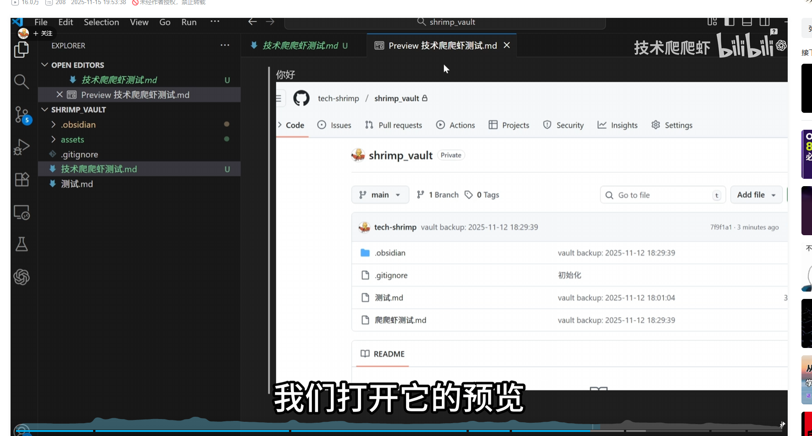

# 设计模式

## 观察者模式:

定义了对象之间的依赖关系

```java
public class UserRegisterEvent {
    private final String username;
    private  final String email;

    public UserRegisterEvent(String username, String email) {
        this.username = username;
        this.email = email;
    }

    public String getUsername() {
        return username;
    }
    public String getEmail() {
        return email;
    }


    @Override
    public String toString() {
            return "UserRegisterEvent{" +
                    "username='" + username + '\'' +
                    ", email='" + email + '\'' +
                    '}';
        }
}
```

注册事件

其中: `ApplicationEventPublisher`关键

applicationEventPublisher.publishEvent(被观测对象)

```java
@Service
public class UserRegisterEventService {


    @Resource
    private ApplicationEventPublisher applicationEventPublisher;


    public void register(String username, String email) {
        UserRegisterEvent event = new UserRegisterEvent(username, email);
        System.out.println("用户注册事件：" + event);
        applicationEventPublisher.publishEvent(event);
    }
}
```

其他订阅该对象使用`@EventLister`

```java
@Component
public class UserLogEventService {
    @EventListener
    public void logUserRegisterEvent(UserRegisterEvent event){
        System.out.println("database is writing info : " + event + "register success");
    }
}
```


> 更新: 2025-10-30 10:14:27  
> 原文: <https://www.yuque.com/alice-hv75k/mtczog/eith50fgfkkshu5k>

